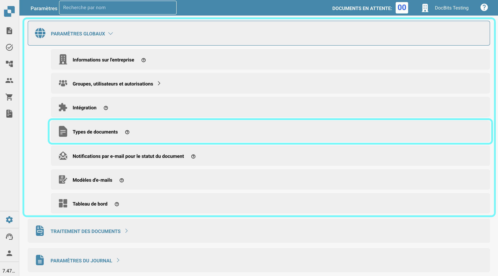

# Plus de paramètres

## Aperçu

Dans la section "Plus de paramètres", vous pouvez trouver diverses options liées aux types de documents individuels. Une fois qu'un paramètre est activé, il s'appliquera uniquement à ce type de document spécifique. Cette page fournit un bref aperçu de ce que fait chaque paramètre.

## Comment accéder

1.  Accédez à **Paramètres** -> **Paramètres globaux** -> **Types de documents**.

    <figure><figcaption></figcaption></figure>
2.  Sélectionnez le type de document souhaité et cliquez sur **Plus de paramètres**.

    <figure><figcaption></figcaption></figure>

## Extraction de table

* **Ignorer la validation du tableau** : Permet de contourner le processus de validation des données de tableau, ce qui peut être utile dans des scénarios où la validation des données doit être flexible.

## Détection des doublons

* [**Détection des documents en double**](duplicate-document-handling.md) : Cela vous permet de détecter et de gérer les documents en double.

## En révision

* **Concevoir le formulaire d'examen** : Configure la mise en page et les champs qui apparaissent dans les formulaires d'examen utilisés lors du processus de révision des documents.

## Rejeter

* **Concevoir le formulaire de rejet** : Configure la mise en page et les champs affichés dans le formulaire de rejet utilisé lors du processus de révision des documents.

## Génération PDF

* **Modèle de conception** : Spécifie le modèle utilisé pour générer des versions PDF des documents, ce qui peut être crucial pour l'archivage ou la communication externe.

## Exporter le format PDF

* **Format du fichier d'exportation** : Vous permet de spécifier le format PDF à utiliser lors de l'exportation des documents.

## Approbation

* **Approuver avant l'exportation** : Assure que les documents doivent être approuvés avant de pouvoir être exportés du système. De plus, vous pouvez concevoir le modèle utilisé pour l'écran d'approbation.
* **Approuver avant l'exportation V2** : Active l'Approbation V2, permettant l'utilisation de champs dynamiques au lieu de statiques. Vous pouvez également personnaliser le modèle de l'écran d'approbation.
* **Deuxième approbation** : Ajoute une couche d'approbation supplémentaire pour une validation supplémentaire, améliorant le contrôle sur le traitement des documents. Vous pouvez également personnaliser le modèle utilisé pour l'écran d'approbation.
* [**Cachet d'approbation**](approval/approval-stamp.md) : Ajoute un cachet au document lorsqu'il est approuvé.
* **Historique de l'approbation** : Permet l'affichage de l'historique des approbations à la fois dans l'écran d'approbation et la validation des champs.

## Bon de commande

* [**Table PO dans le générateur de mise en page**](purchase-order/po-table-in-layout-builder.md) : Permet l'inclusion de tables de bon de commande dans le générateur de mise en page pour des mises en page de documents personnalisées.
* [**Vérification automatique des mises à jour de l'OP**](purchase-order/auto-check-for-po-updates.md) : Lorsqu'elle est activée, le système affiche un indicateur visuel dans l'écran de correspondance des bons de commande pour montrer quand un bon de commande a été mis à jour, incitant les utilisateurs à actualiser pour obtenir les dernières informations.
* **Mise à jour automatique des données de la commande** : L'activation de cette option mettra automatiquement à jour les données de la commande lorsque de nouvelles données sont disponibles.
* **Statut de la ligne de commande consommée** : L'activation de cette option désactivera la teinte colorée sur les lignes de bon de commande.
* [**Calculer le prix unitaire de la commande**](purchase-order/calculate-po-unit-price.md) : Cela vous permet de calculer le prix unitaire de la commande en utilisant le montant net et la quantité, au lieu de l'extraire.
* [**Bon de commande**](purchase-order/purchase-order.md) : Bascule si le document doit être traité dans l'écran de correspondance des bons de commande. Vous pouvez également spécifier sur quel terme de quantité le processus de correspondance doit être basé.
* [**Exporter les lignes de bon de commande non assorties**](purchase-order/export-not-matched-po-lines.md) : Cette fonctionnalité contrôle l'exportation des lignes de bon de commande. Lorsqu'elle est désactivée, seules les lignes appariées sont exportées. Lorsqu'elle est activée, toutes les lignes de bon de commande sont exportées, même si elles ne sont pas appariées à une ligne de confirmation de commande.
* [**Paramètre de tolérance PO**](purchase-order/purchase-order-tolerance-settings-additional-purchase-order-tolerance.md) : Cette fonctionnalité vous permet de définir des niveaux de tolérance pour la quantité et le prix unitaire, en tenant compte des petites divergences sans les signaler comme des incohérences.
* [**Paramètre de tolérance PO supplémentaire**](purchase-order/purchase-order-tolerance-settings-additional-purchase-order-tolerance.md#parametre-pour-configurer-les-parametres-de-tolerance-de-commande-dachat-supplementaires) : Cette fonctionnalité vous permet de définir des niveaux de tolérance supplémentaires pour le fret, les charges et les taxes, en tenant compte des petites divergences sans les signaler comme des incohérences.
* [**Exportation alternative**](purchase-order/alternate-export.md) : Cela vous permet de configurer une exportation alternative pour des statuts spécifiques.
* [**PO désactiver statuts**](purchase-order/purchase-order-disable-statuses.md) : Vous permet de désactiver des statuts spécifiques pour qu'ils ne soient pas pris en compte dans le processus de correspondance.
* **Ignorer les lignes déjà appariées** : L'activation de cette option ignorera les lignes qui ont déjà été appariées lors d'un nouveau processus de correspondance.
* [**Carte des numéros d'articles des fournisseurs**](purchase-order/supplier-item-number-map-admin-documentation.md) : Un paramètre utilitaire qui associe les numéros d'articles des fournisseurs aux numéros d'articles internes, garantissant l'exactitude dans la gestion des stocks et des bons de commande.
