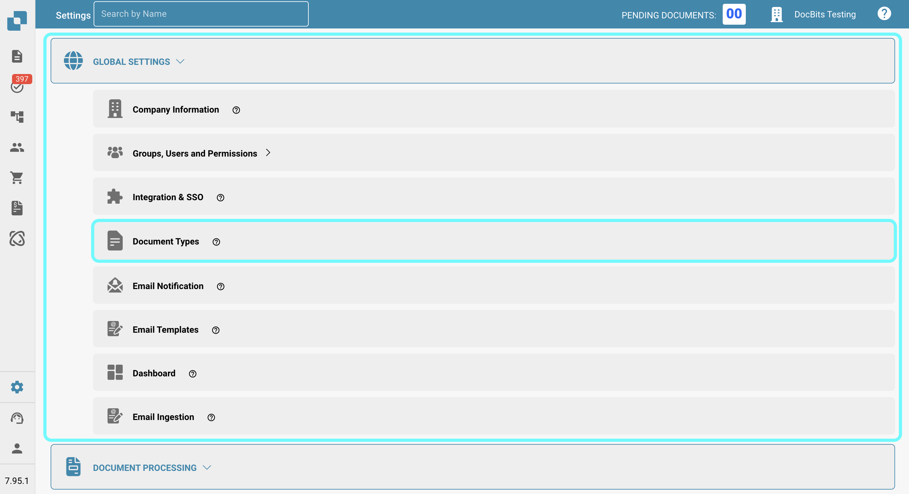

# More Settings

## Overview

In the "More Settings" section, you can find various options related to individual document types. Once a setting is activated, it will apply only to that specific document type. This page provides a brief overview of what each setting does.

## How to Access

1.  Navigate to **Settings** -> **Global Settings** -> **Document Types**.

    <figure><figcaption></figcaption></figure>
2.  Select the desired document type and click on **More Settings**.

    <figure><figcaption></figcaption></figure>

## Table Extraction

* **Skip table validation**: Allows bypassing the validation process for table data, which can be useful in scenarios where data validation needs to be flexible.

## Duplicate Detection

* [**Duplicate Document Detection**](duplicate-document-handling.md): This allows you to detect and handle duplicate documents.

## In Review

* **Design in Review Form**: Configures the layout and fields that appear in the review forms used during the document review process.

## Reject

* **Design in Reject Form**: Configures the layout and fields displayed in the reject form used during the document review process.

## PDF Generation

* **Design Template**: Specifies the template used for generating PDF versions of the documents, which can be crucial for archiving or external communication.

## Export PDF Format

* **Export File Format**: Allows you to specify the PDF format to be used when exporting documents.

## Approval

* **Approve before export**: Ensures that documents must be approved before they can be exported from the system. Additionally, you can design the template used for the approval screen.
* **Approve before export V2**: Enables Approval V2, allowing the use of dynamic fields instead of static ones. You can also customize the approval screen template.
* **Second Approval**: Adds an additional layer of approval for further validation, enhancing control over document processing. You can also customize the template used for the approval screen.
* [**Approval Stamp**](approval/approval-stamp.md): Adds a stamp to the document when it is approved.
* [**Approval History**](approval/approval-history.md): Enables the display of approval history in both the approval screen and field validation.

## Purchase Order

* [**PO table in layout builder**](purchase-order/po-table-in-layout-builder.md): Enables the inclusion of purchase order tables in the layout builder for customized document layouts.
* [**Auto check for PO updates**](purchase-order/auto-check-for-po-updates.md): When enabled, the system displays a visual indicator in the Purchase Order Matching screen to show when a purchase order has been updated, prompting users to refresh for the latest information.
* **Auto update PO data**: Activating this will automatically update the PO data when new data is available.
* **Consumed PO line status**: Activating this will disable the colored tint on the purchase order lines.
* [**Calculate PO unit price**](purchase-order/calculate-po-unit-price.md): This lets you calculate the PO unit price using the net amount and quantity, instead of extracting it.
* [**Purchase Order**](purchase-order/purchase-order.md): Toggles whether the document should be processed in the Purchase Order Matching screen. You can also specify which quantity term the matching process should be based on.
* [**Export not matched PO lines**](purchase-order/export-not-matched-po-lines.md): This feature controls the export of purchase order lines. When disabled, only matched lines are exported. When enabled, all purchase order lines are exported, even if they are not matched to an order confirmation line.
* [**PO Tolerance Setting**](purchase-order/purchase-order-tolerance-settings-additional-purchase-order-tolerance.md): This feature lets you set tolerance levels for quantity and unit price, accommodating minor discrepancies without flagging them as mismatches.
* [**Additional PO Tolerance Setting**](purchase-order/purchase-order-tolerance-settings-additional-purchase-order-tolerance.md#setting-to-configure-additional-purchase-order-tolerance-settings): This feature lets you set additional tolerance levels for freight, charges, and taxes, accommodating minor discrepancies without flagging them as mismatches.
* **Alternate Export**: This allows you to set up an alternative export for specific statuses.
* [**PO disable statuses**](purchase-order/purchase-order-disable-statuses.md): Allows you to disable specific statuses from being considered in the matching process.
* **Ignore Already Matched Lines**: Activating this will skip lines that have already been matched during a new matching process.
* [**Supplier Item Number Map**](purchase-order/supplier-item-number-map-admin-documentation.md): A utility setting that maps supplier item numbers to internal item numbers, ensuring accuracy in inventory and purchase order management.
