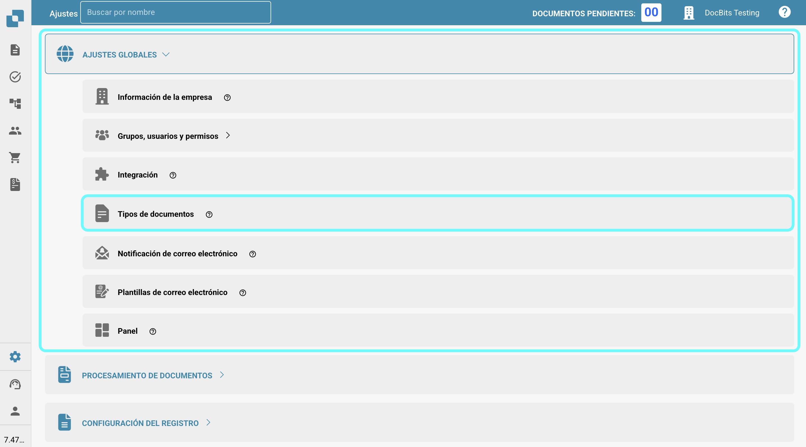
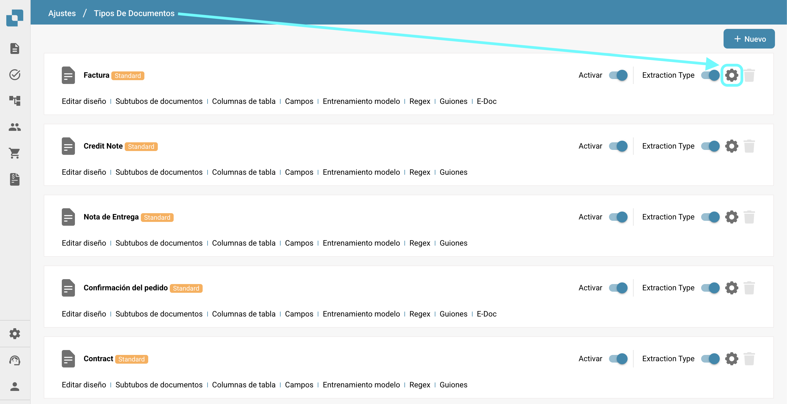

# Más ajustes

## Descripción general

En la sección "Más ajustes", puedes encontrar varias opciones relacionadas con tipos de documentos individuales. Una vez que se activa un ajuste, se aplicará solo a ese tipo de documento específico. Esta página proporciona una breve descripción de lo que hace cada ajuste.

## Cómo acceder

1.  Navega a **Ajustes** -> **Ajustes globales** -> **Tipos de documentos**.

    <figure><figcaption></figcaption></figure>
2.  Selecciona el tipo de documento deseado y haz clic en **Más ajustes**.

    <figure><figcaption></figcaption></figure>

## Extracción de tabla

* **Saltar validación de tabla**: Permite omitir el proceso de validación para los datos de la tabla, lo que puede ser útil en escenarios donde la validación de datos necesita ser flexible.

## Detección de duplicados

* **Detección de documentos duplicados:** Esto te permite detectar y manejar documentos duplicados.

## En revisión

* **Diseñar el formulario de revisión**: Configura el diseño y los campos que aparecen en los formularios de revisión utilizados durante el proceso de revisión de documentos.

## Rechazar

* **Diseñar el formulario de rechazo:** Configura el diseño y los campos que se muestran en el formulario de rechazo utilizado durante el proceso de revisión de documentos.

## Generación PDF

* **Plantilla de diseño**: Especifica la plantilla utilizada para generar versiones PDF de los documentos, lo que puede ser crucial para el archivo o la comunicación externa.

## Exportar formato PDF

* **Formato del archivo de exportación**: Te permite especificar el formato PDF que se utilizará al exportar documentos.

## Aprobación

* **Aprobar antes de la exportación**: Asegura que los documentos deben ser aprobados antes de que puedan ser exportados del sistema. Además, puedes diseñar la plantilla utilizada para la pantalla de aprobación.
* **Aprobar antes de la exportación V2**: Habilita la Aprobación V2, permitiendo el uso de campos dinámicos en lugar de estáticos. También puedes personalizar la plantilla de la pantalla de aprobación.
* **Segunda aprobación**: Agrega una capa adicional de aprobación para una validación adicional, mejorando el control sobre el procesamiento de documentos. También puedes personalizar la plantilla utilizada para la pantalla de aprobación.
* [**Sello de aprobación**](approval/approval-stamp.md)**:** Agrega un sello al documento cuando es aprobado.
* **Historial de aprobaciones**: Permite la visualización del historial de aprobaciones tanto en la pantalla de aprobación como en la validación de campos.

## Orden de compra

* [**Tabla de órdenes de compra en el generador de diseños**](purchase-order/po-table-in-layout-builder.md): Permite la inclusión de tablas de órdenes de compra en el generador de diseños para diseños de documentos personalizados.
* [**Comprobación automática de actualizaciones de pedidos**](purchase-order/auto-check-for-po-updates.md): Cuando está habilitado, el sistema muestra un indicador visual en la pantalla de coincidencia de órdenes de compra para mostrar cuándo se ha actualizado una orden de compra, lo que invita a los usuarios a actualizar para obtener la información más reciente.
* **Actualización automática de los datos del pedido**: Activar esto actualizará automáticamente los datos del pedido cuando haya nuevos datos disponibles.
* **Estado de la línea de pedido consumida**: Activar esto desactivará el tinte de color en las líneas de órdenes de compra.
* [**Calcular el precio unitario del pedido**](purchase-order/calculate-po-unit-price.md): Esto te permite calcular el precio unitario del pedido utilizando el monto neto y la cantidad, en lugar de extraerlo.
* **Orden de compra**: Alterna si el documento debe ser procesado en la pantalla de coincidencia de órdenes de compra. También puedes especificar sobre qué término de cantidad debe basarse el proceso de coincidencia.
* [**Exportar líneas de PO no coincidentes**](purchase-order/export-not-matched-po-lines.md): Esta función controla la exportación de líneas de órdenes de compra. Cuando está desactivada, solo se exportan las líneas coincidentes. Cuando está habilitada, se exportan todas las líneas de órdenes de compra, incluso si no están coincidiendo con una línea de confirmación de pedido.
* [**Configuración de tolerancia de PO**](purchase-order/purchase-order-tolerance-settings-additional-purchase-order-tolerance.md)**:** Esta función te permite establecer niveles de tolerancia para cantidad y precio unitario, acomodando discrepancias menores sin marcarlas como desajustes.
* [**Configuración de tolerancia de PO adicional**](purchase-order/purchase-order-tolerance-settings-additional-purchase-order-tolerance.md#ajuste-para-configurar-la-ajuste-adicional-de-tolerancia-de-ordenes-de-compra): Esta función te permite establecer niveles de tolerancia adicionales para fletes, cargos e impuestos, acomodando discrepancias menores sin marcarlas como desajustes.
* **Exportación alternativa**: Esto te permite configurar una exportación alternativa para estados específicos.
* [PO desactivar estados](purchase-order/purchase-order-disable-statuses.md): Permite desactivar estados específicos para que no se consideren en el proceso de coincidencia.
* **Ignorar líneas ya coincidentes**: Activar esto omitirá las líneas que ya han sido coincidentes durante un nuevo proceso de coincidencia.
* [**Número de artículo del proveedor**](purchase-order/supplier-item-number-map-admin-documentation.md): Una configuración de utilidad que mapea los números de artículo del proveedor a números de artículo internos, asegurando precisión en la gestión de inventario y órdenes de compra.
