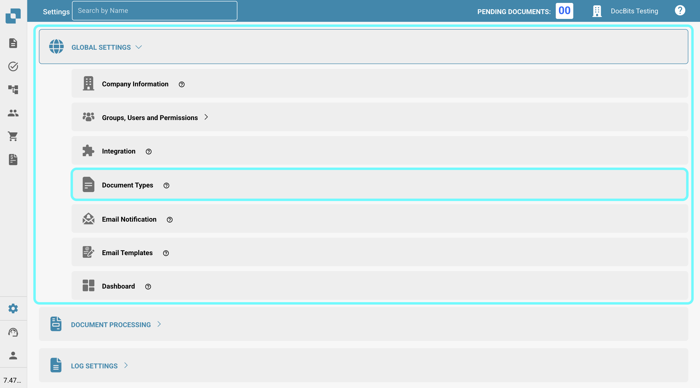
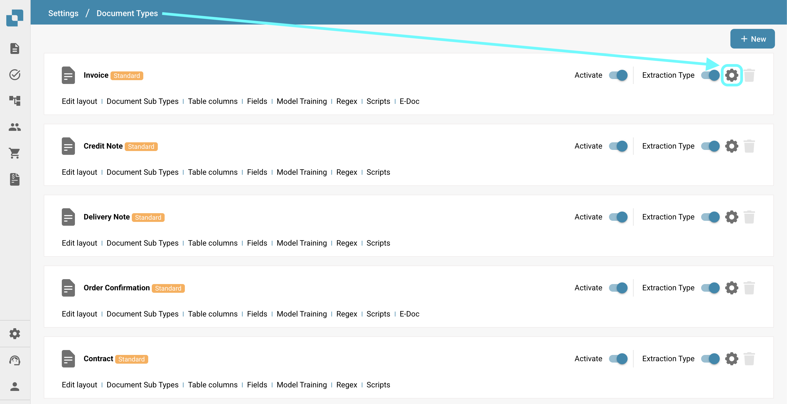

# Więcej ustawień

## Przegląd

W sekcji "Więcej ustawień" znajdziesz różne opcje związane z poszczególnymi typami dokumentów. Po aktywowaniu ustawienia będzie ono miało zastosowanie tylko do danego typu dokumentu. Ta strona zawiera krótki przegląd tego, co robi każde ustawienie.

## Jak uzyskać dostęp

1.  Przejdź do **Ustawienia** -> **Ustawienia globalne** -> **Typy dokumentów**.

    <figure><figcaption></figcaption></figure>
2.  Wybierz żądany typ dokumentu i kliknij **Więcej ustawień**.

    <figure><figcaption></figcaption></figure>

## Ekstrakcja tabeli

* **Pomiń walidację tabeli**: Umożliwia pominięcie procesu walidacji danych tabeli, co może być przydatne w scenariuszach, gdzie walidacja danych musi być elastyczna.

## Wykrywanie duplikatów

* [**Wykrywanie duplikatów dokumentów**](duplicate-document-handling.md): Umożliwia wykrywanie i obsługę duplikatów dokumentów.

## W recenzji

* **Projekt w formularzu recenzji**: Konfiguruje układ i pola, które pojawiają się w formularzach recenzji używanych podczas procesu przeglądu dokumentów.

## Odrzuć

* **Projekt w formularzu odrzucenia**: Konfiguruje układ i pola wyświetlane w formularzu odrzucenia używanym podczas procesu przeglądu dokumentów.

## Generowanie PDF

* **Szablon projektu**: Określa szablon używany do generowania wersji PDF dokumentów, co może być kluczowe dla archiwizacji lub komunikacji zewnętrznej.

## Eksport formatu PDF

* **Format pliku eksportu**: Umożliwia określenie formatu PDF, który ma być używany podczas eksportu dokumentów.

## Zatwierdzenie

* **Zatwierdź przed eksportem**: Zapewnia, że dokumenty muszą być zatwierdzone przed ich eksportem z systemu. Dodatkowo możesz zaprojektować szablon używany dla ekranu zatwierdzenia.
* **Zatwierdź przed eksportem V2**: Włącza Zatwierdzenie V2, umożliwiając użycie dynamicznych pól zamiast statycznych. Możesz również dostosować szablon ekranu zatwierdzenia.
* **Drugie zatwierdzenie**: Dodaje dodatkową warstwę zatwierdzenia dla dalszej walidacji, zwiększając kontrolę nad przetwarzaniem dokumentów. Możesz również dostosować szablon używany dla ekranu zatwierdzenia.
* [**Stempel zatwierdzenia**](approval/approval-stamp.md): Dodaje stempel do dokumentu, gdy jest on zatwierdzony.
* **Historia zatwierdzeń**: Umożliwia wyświetlanie historii zatwierdzeń zarówno na ekranie zatwierdzenia, jak i w walidacji pól.

## Zamówienie zakupu

* [**Tabela PO w kreatorze układów**](purchase-order/po-table-in-layout-builder.md): Umożliwia dodanie tabel zamówień zakupu w kreatorze układów dla dostosowanych układów dokumentów.
* [**Automatyczne sprawdzanie aktualizacji PO**](purchase-order/auto-check-for-po-updates.md): Po włączeniu system wyświetla wizualny wskaźnik na ekranie dopasowania zamówienia zakupu, aby pokazać, kiedy zamówienie zakupu zostało zaktualizowane, zachęcając użytkowników do odświeżenia w celu uzyskania najnowszych informacji.
* **Automatyczna aktualizacja danych PO**: Aktywacja tego ustawienia automatycznie zaktualizuje dane PO, gdy nowe dane będą dostępne.
* [**Status linii PO zużytej**](purchase-order/consumed-po-line-status.md): Aktywacja tego ustawienia wyłączy kolorowy odcień na liniach zamówienia zakupu.
* [**Oblicz jednostkową cenę PO**](purchase-order/calculate-po-unit-price.md): Umożliwia obliczenie jednostkowej ceny PO na podstawie kwoty netto i ilości, zamiast jej wydobywania.
* [**Zamówienie zakupu**](purchase-order/purchase-order.md): Przełącza, czy dokument powinien być przetwarzany na ekranie dopasowania zamówienia zakupu. Możesz również określić, na podstawie jakiego terminu ilościowego powinien opierać się proces dopasowania.
* [**Eksportuj niepasujące linie PO**](purchase-order/export-not-matched-po-lines.md): Ta funkcja kontroluje eksport linii zamówienia zakupu. Po wyłączeniu eksportowane są tylko dopasowane linie. Po włączeniu eksportowane są wszystkie linie zamówienia zakupu, nawet jeśli nie są dopasowane do linii potwierdzenia zamówienia.
* [**Ustawienie tolerancji PO**](purchase-order/purchase-order-tolerance-settings-additional-purchase-order-tolerance.md): Ta funkcja pozwala ustawić poziomy tolerancji dla ilości i ceny jednostkowej, uwzględniając drobne niezgodności bez oznaczania ich jako różnice.
* [**Dodatkowe ustawienie tolerancji PO**](purchase-order/purchase-order-tolerance-settings-additional-purchase-order-tolerance.md#ustawienie-do-konfigurowania-dodatkowych-ustawien-tolerancji-zamowienia-zakupu): Ta funkcja pozwala ustawić dodatkowe poziomy tolerancji dla frachtu, opłat i podatków, uwzględniając drobne niezgodności bez oznaczania ich jako różnice.
* [**Alternatywny eksport**](purchase-order/alternate-export.md): Umożliwia skonfigurowanie alternatywnego eksportu dla określonych statusów.
* [**Wyłącz statusy PO**](purchase-order/purchase-order-disable-statuses.md): Umożliwia wyłączenie określonych statusów z uwzględnienia w procesie dopasowania.
* **Ignoruj już dopasowane linie**: Aktywacja tego ustawienia pominie linie, które już zostały dopasowane podczas nowego procesu dopasowania.
* [**Aktualizacja dokumentu Status zamówienia zakupu**](purchase-order/update-document-purchase-order-status.md): Gdy jest włączone, kolumna Status PO na tablicy rozdzielczej jest automatycznie aktualizowana za każdym razem, gdy zmienia się status zamówienia zakupu.
* [**Mapa numerów przedmiotów dostawcy**](purchase-order/supplier-item-number-map-admin-documentation.md): Ustawienie pomocnicze, które mapuje numery przedmiotów dostawcy na wewnętrzne numery przedmiotów, zapewniając dokładność w zarządzaniu zapasami i zamówieniami zakupu.
