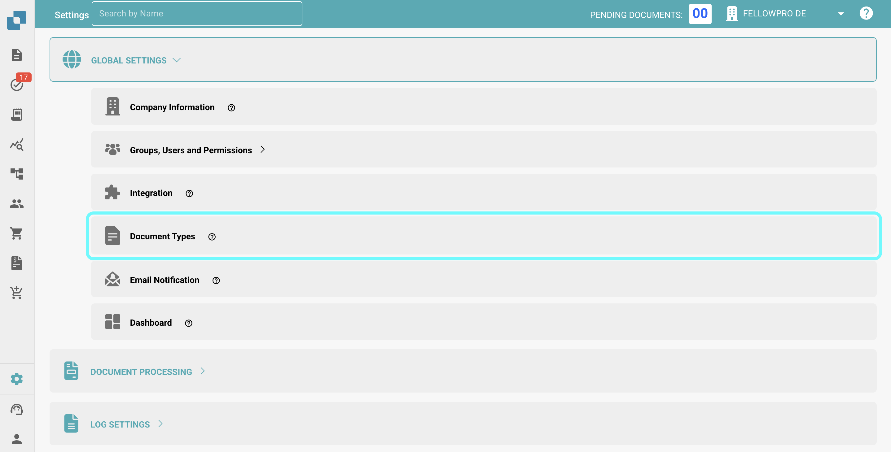
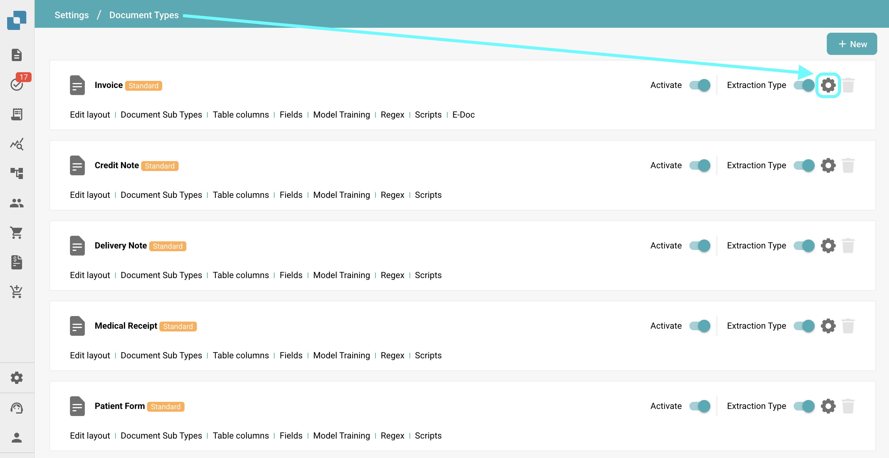
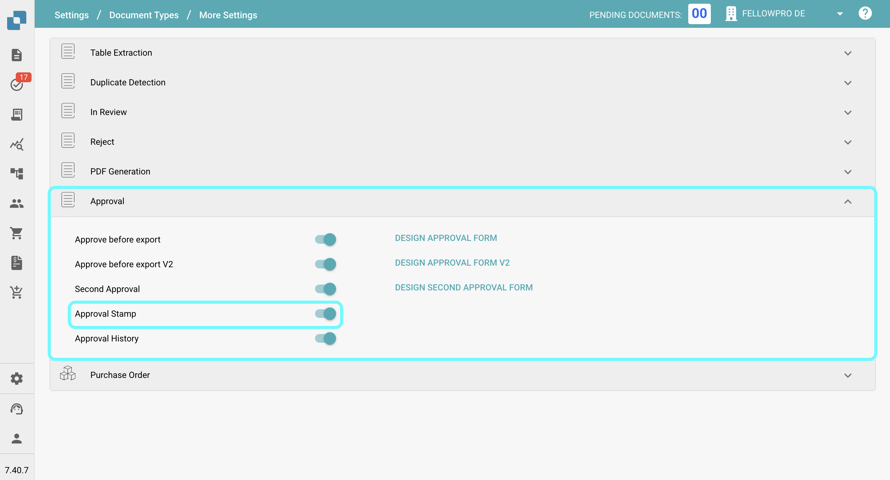
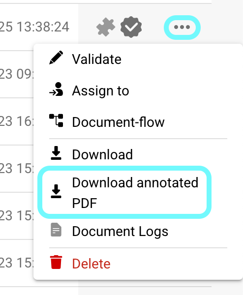

# Approval Stamp

## **Overview:**

This feature automatically adds an approval stamp to a document when it is approved in the approval screen. . If a document contains a approval stamp, it will be included when exporting to IDM

## Activating the Approval Stamp Feature

To activate the Approval Stamp feature, follow these steps:

1.  Go to **Settings** → **Global Settings** → **Document Types**.

    <figure><figcaption></figcaption></figure>
2.  **Select the Document Type** for which you want to enable the stamp approval and click on **More Settings**.

    <figure><figcaption></figcaption></figure>
3.  Under the **Approval** section, enable the **Approval Stamp** option.

    <figure><figcaption></figcaption></figure>

## After Activation:

Once the feature is activated, any document in the "pending approval" state will automatically receive an approval stamp once it is approved. The stamp will include the "Approved" logo, the name of the user who approved the document, and the time at which the document was approved.

<figure><figcaption></figcaption></figure>

<figure><figcaption></figcaption></figure>

### Downloading PDFs with or without Annotations 

* If a document has annotations, you can choose to download the PDF either with or without the annotations.
* To do this, go to the **Dashboard**.
* Click on the **three dots** in the **Action** column.
* Select one of the two available download options:
  * **Download with Annotations**
  * **Download without Annotations**

<figure><figcaption></figcaption></figure>
