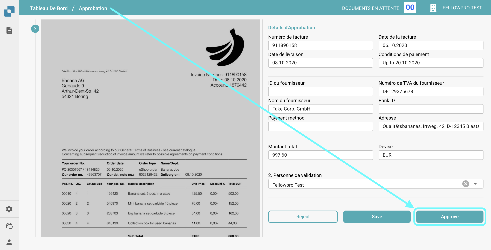

# Cachet d'approbation

## **Aperçu :**

Cette fonctionnalité ajoute automatiquement un cachet d'approbation à un document lorsqu'il est approuvé dans l'écran d'approbation. Si un document contient un cachet d'approbation, il sera inclus lors de l'**exportation vers IDM**.

## Activation de la fonctionnalité Cachet d'approbation

Pour activer la fonctionnalité Cachet d'approbation, suivez ces étapes :

1.  Allez dans **Paramètres** → **Paramètres Globaux** → **Types de documents**.

    <figure><figcaption></figcaption></figure>
2.  **Sélectionnez le Type de Document** pour lequel vous souhaitez activer le cachet d'approbation et cliquez sur **Plus de Paramètres**.

    <figure><figcaption></figcaption></figure>
3.  Dans la section **Approbation**, activez l'option **Cachet d'approbation**.

    <figure><figcaption></figcaption></figure>

## Après activation :

Une fois la fonctionnalité activée, tout document en état "d'approbation en attente" recevra automatiquement un cachet d'approbation une fois qu'il sera approuvé. Le cachet inclura le logo "Approved", le nom de l'utilisateur qui a approuvé le document, et l'heure à laquelle le document a été approuvé.

<figure><figcaption></figcaption></figure>

<figure><figcaption></figcaption></figure>

### Téléchargement de PDFs avec ou sans le **Cachet d'approbation** 

* Si un document a un cachet d'approbation, vous pouvez choisir de télécharger le PDF soit avec, soit sans le cachet d'approbation.
* Pour ce faire, allez dans le **Tableau De Bord**.
* Cliquez sur les **trois points** dans la colonne **Actions**.
*   Sélectionnez l'une des deux options de téléchargement disponibles :

    * **Télécharger avec Annotations**
    * **Télécharger sans Annotations**

    <figure><figcaption></figcaption></figure>
