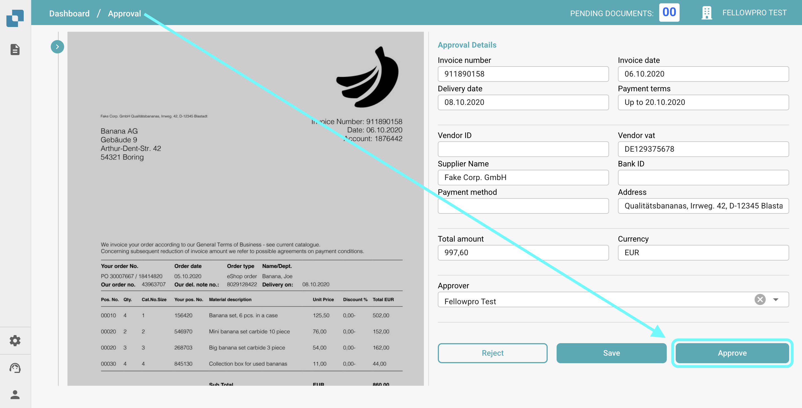
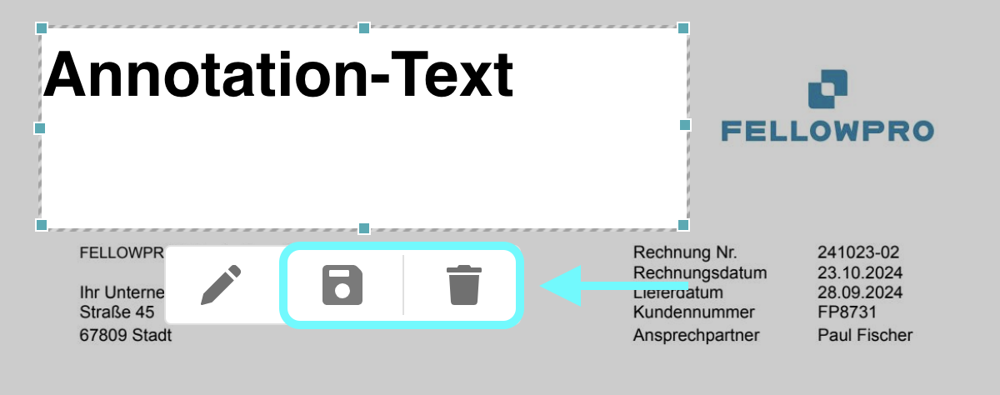

# Approval Stamp

## Activating the Approval Stamp

To activate the Approval Stamp feature, follow these steps:

1.  Go to **Settings** → **Global Settings** → **Document Types**.

    <figure><figcaption></figcaption></figure>
2.  **Select the Document Type** for which you want to enable the stamp approval and click on **More Settings**.

    <figure><figcaption></figcaption></figure>
3.  Under the **Approval** section, enable the **Approval Stamp** option.

    <figure><figcaption></figcaption></figure>

Once activated, you will see a new menu at the bottom right of the approval screen. This menu includes two options:

* **Stamp Annotation Tool**
* **Text Annotation Tool**

<figure><figcaption></figcaption></figure>

## Stamp Annotation Tool

To add a stamp to your document, follow these steps:

1.  **Click on the Stamp Icon**: This will open the stamp options.

    
<figure><figcaption></figcaption></figure>

2. Choose **Approved** or **Rejected** from the dropdown menu.
3.  If you want to create a stamp, click the **Add** button.

    <figure><figcaption></figcaption></figure>
4. Once the stamp is placed, you can **drag and drop** it to adjust its position.
5. **Click on the stamp field** to adjust its size
6.  To save the stamp, click the **Save Icon**; to remove it, click the **Delete Icon**.

    <figure><figcaption></figcaption></figure>

## Text Annotation Tool

To add a text annotation to your document, follow these steps:

1.  You can either:

    * **Click on a color** to create a text field, which will automatically open the text editing menu, or

    
<figure><figcaption></figcaption></figure>

    * **Double-click** anywhere on the document to create a text field, then click the **pen icon** to open the text editing menu.

    <figure><figcaption></figcaption></figure>
2.  In the text editing menu, you can:

    * Add your annotation text
    * Adjust the **font**, **size**, **color**, and **style** (Bold/Italic)
    * To save the annotation text, click the **Save** button.

    <figure><figcaption></figcaption></figure>
3. Once the text field is placed, you can **drag and drop** it to adjust its position.
4.  To save the stamp, click the **Save Icon**; to remove it, click the **Delete Icon**.

    <figure><figcaption></figcaption></figure>
