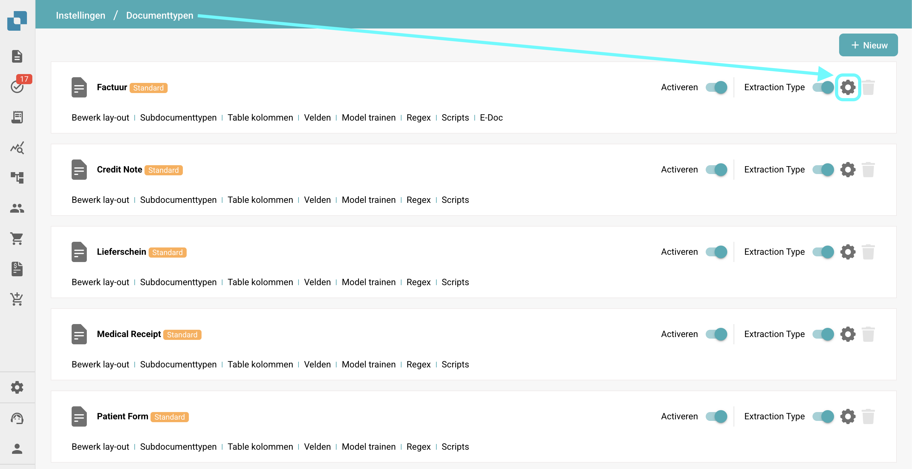
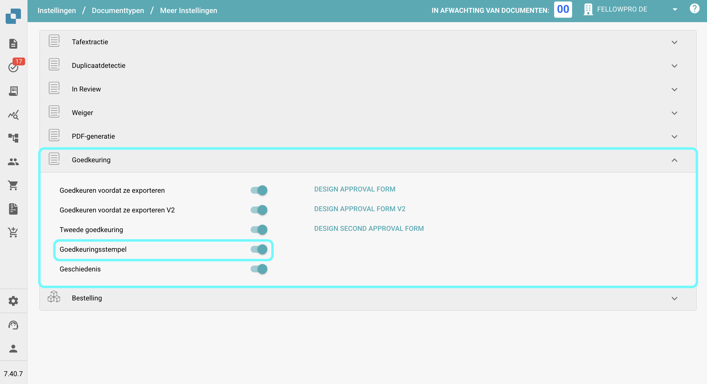
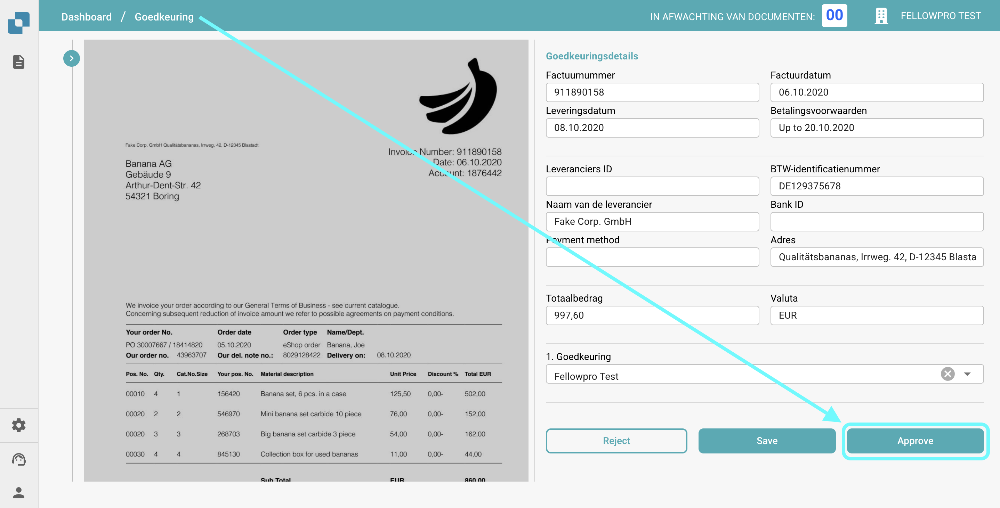

# Goedkeuringsstempel

## **Overzicht:**

Deze functie voegt automatisch een goedkeuringsstempel toe aan een document wanneer het wordt goedgekeurd in het goedkeuringsscherm. Als een document een goedkeuringsstempel bevat, wordt deze opgenomen bij het **exporteren naar IDM**.

## Het inschakelen van de Goedkeuringsstempelfunctie

Volg deze stappen om de goedkeuringsstempelfunctie in te schakelen:

1.  Ga naar **Instellingen** → **Algemene Instellingen** → **Documenttypen**.

    <figure><figcaption></figcaption></figure>
2.  **Selecteer het Documenttype** waarvoor je de stempelgoedkeuring wilt inschakelen en klik op **Meer Instellingen**.

    <figure><figcaption></figcaption></figure>
3.  Schakel onder de sectie **Goedkeuring** de optie **Goedkeuringsstempel** in.

    <figure><figcaption></figcaption></figure>

## Na Activatie:

Zodra de functie is geactiveerd, ontvangt elk document in de status "in afwachting van goedkeuring" automatisch een goedkeuringsstempel zodra het is goedgekeurd. De stempel bevat het "Approved" logo, de naam van de gebruiker die het document heeft goedgekeurd, en het tijdstip waarop het document is goedgekeurd.

<figure><figcaption></figcaption></figure>

<figure><figcaption></figcaption></figure>

### PDF's downloaden met of zonder de **Goedkeuringsstempel** 

* Als een document een goedkeuringsstempel heeft, kun je ervoor kiezen om de PDF te downloaden met of zonder de goedkeuringsstempel.
* Ga hiervoor naar het **Dashboard**.
* Klik op de **drie stippen** in de **Actie** kolom.
*   Selecteer een van de twee beschikbare downloadopties:

    * **Downloaden met Annotaties**
    * **Downloaden zonder Annotaties**

    <figure><figcaption></figcaption></figure>
