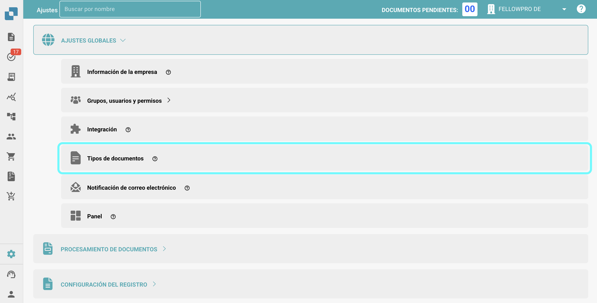
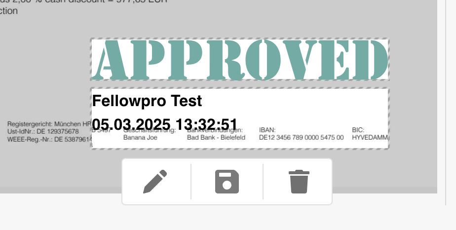

# Sello de aprobación

## **Descripción general:**

Esta función agrega automáticamente un sello de aprobación a un documento cuando se aprueba en la pantalla de aprobación. Si un documento contiene un sello de aprobación, se incluirá al **exportar a IDM**.

## Activando la función de Sello de Aprobación

Para activar la función de Sello de Aprobación, sigue estos pasos:

1.  Ve a **Ajustes** → **Ajustes Globales** → **Tipos de documentos**.

    <figure><figcaption></figcaption></figure>
2.  **Selecciona el Tipo de Documento** para el cual deseas habilitar la aprobación del sello y haz clic en **Más Ajustes**.

    <figure><figcaption></figcaption></figure>
3.  En la sección de **Aprobación**, habilita la opción de **Sello de Aprobación**.

    <figure><figcaption></figcaption></figure>

## Después de la Activación:

Una vez que la función está activada, cualquier documento en estado "pendiente de aprobación" recibirá automáticamente un sello de aprobación una vez que sea aprobado. El sello incluirá el logo de "Approved", el nombre del usuario que aprobó el documento y la hora en la que se aprobó el documento.

<figure><figcaption></figcaption></figure>

<figure><figcaption></figcaption></figure>

### Descargando PDFs con o sin el **Sello de Aprobación** 

* Si un documento tiene un sello de aprobación, puedes elegir descargar el PDF con o sin el sello de aprobación.
* Para hacer esto, ve al **Panel**.
* Haz clic en los **tres puntos** en la columna de **Comportamiento**.
*   Selecciona una de las dos opciones de descarga disponibles:

    * **Descargar con Anotaciones**
    * **Descargar sin Anotaciones**

    <figure><figcaption></figcaption></figure>
