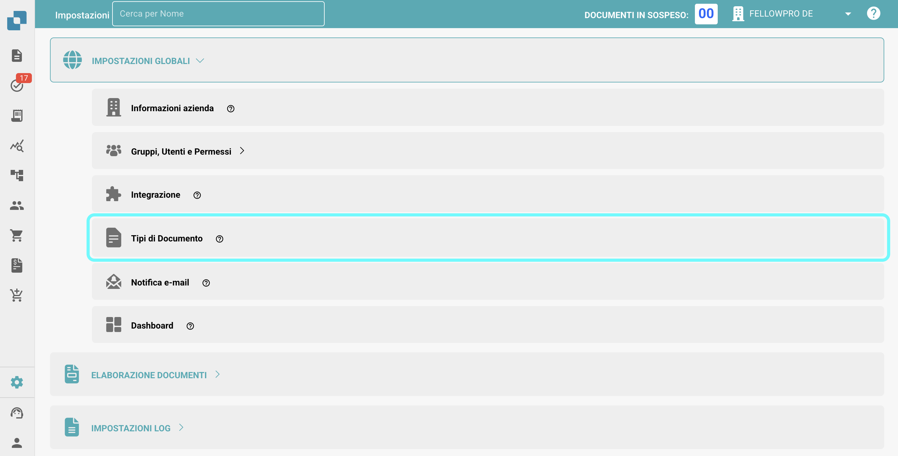
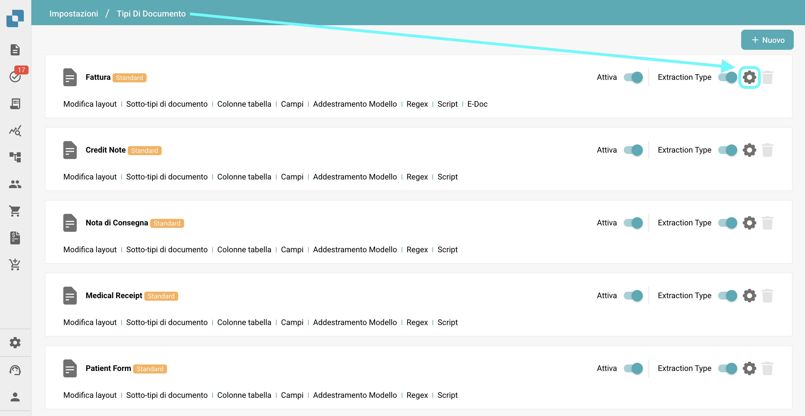
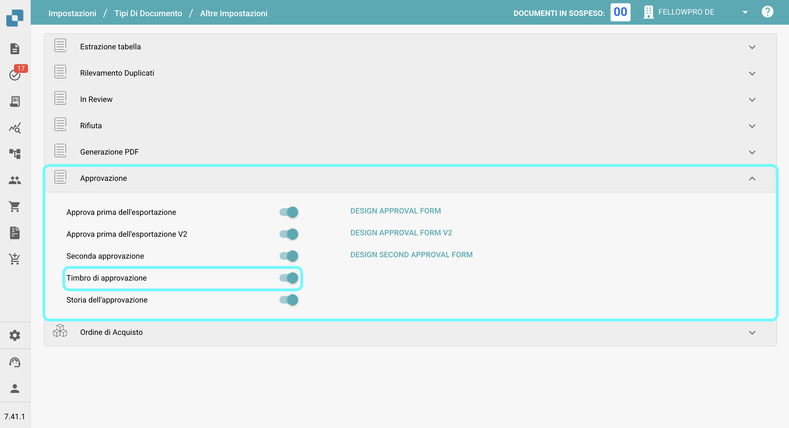
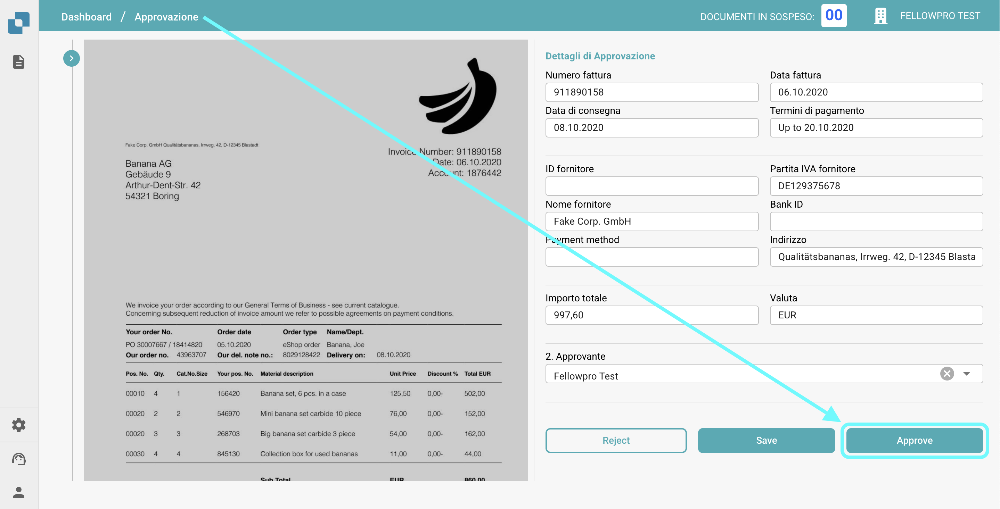
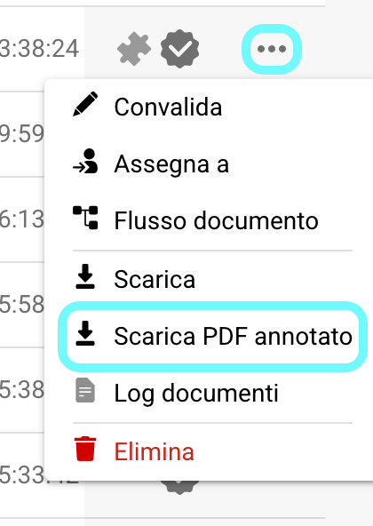

# Timbro di approvazione

## **Panoramica:**

Questa funzionalità aggiunge automaticamente un timbro di approvazione a un documento quando viene approvato nella schermata di approvazione. Se un documento contiene un timbro di approvazione, sarà incluso quando **esportato in IDM**.

## Attivazione della funzionalità Timbro di approvazione

Per attivare la funzionalità Timbro di approvazione, segui questi passaggi:

1.  Vai su **Impostazioni** → **Impostazioni Globali** → **Tipi Di Documento**.

    <figure><figcaption></figcaption></figure>
2.  **Seleziona il Tipo di Documento** per il quale desideri abilitare l'approvazione del timbro e fai clic su **Altre Impostazioni**.

    <figure><figcaption></figcaption></figure>
3.  Nella sezione **Approvazione**, abilita l'opzione **Timbro di approvazione**.

    <figure><figcaption></figcaption></figure>

## Dopo l'attivazione:

Una volta attivata la funzionalità, qualsiasi documento nello stato "in attesa di approvazione" riceverà automaticamente un timbro di approvazione una volta approvato. Il timbro includerà il logo "Approved", il nome dell'utente che ha approvato il documento e il momento in cui il documento è stato approvato.

<figure><figcaption></figcaption></figure>

<figure><figcaption></figcaption></figure>

### Download di PDF con o senza il **Timbro di approvazione** 

* Se un documento ha un timbro di approvazione, puoi scegliere di scaricare il PDF con o senza il timbro di approvazione.
* Per fare ciò, vai alla **Dashboard**.
* Fai clic sui **tre puntini** nella colonna **Azioni**.
*   Seleziona una delle due opzioni di download disponibili:

    * **Scarica con Annotazioni**
    * **Scarica senza Annotazioni**

    <figure><figcaption></figcaption></figure>
