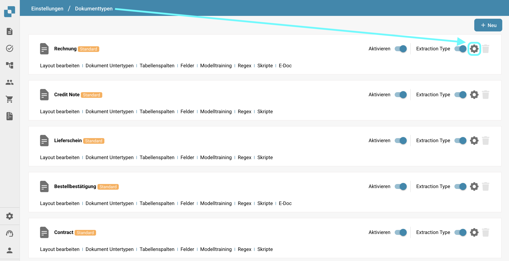
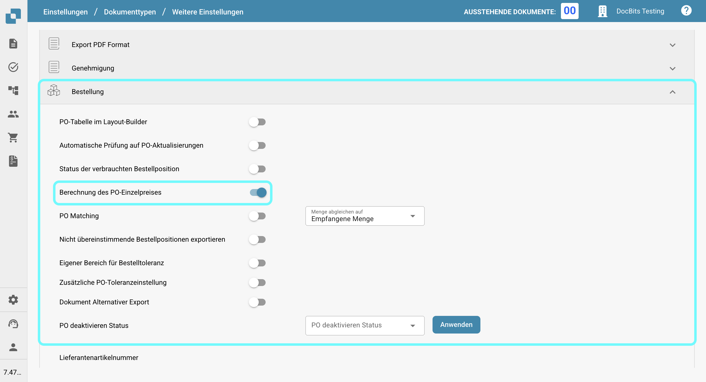

# Berechnung des PO-Einzelpreises

## **Überblick**

Sie können wählen, den Einzelpreis manuell zu berechnen, indem Sie den Nettobetrag durch die Menge teilen, anstatt ihn automatisch aus dem Dokument zu extrahieren. Dies ist besonders nützlich, wenn der Einzelpreis in der **Bestellung** (in Infor) von dem Preis abweicht, der aus dem Dokument extrahiert wird. Solche Abweichungen können auftreten, wenn ein Rabatt auf den Einzelpreis in der Infor-Bestellung angewendet wird, während das Dokument den Rabatt nur auf den Nettobetrag anwendet.

## **Aktivierungsschritte**

1.  Navigieren Sie zu **Einstellungen** -> **Globale Einstellungen** -> **Dokumenttypen**.

    <figure><figcaption></figcaption></figure>
2.  Wählen Sie den gewünschten Dokumenttyp aus und klicken Sie auf **Weitere Einstellungen**.

    <figure><figcaption></figcaption></figure>
3.  Aktivieren Sie im Abschnitt **Bestellung** die Option **Berechnung des PO-Einzelpreises**.

    <figure><figcaption></figcaption></figure>

## Beispiel:

<figure><figcaption></figcaption></figure>

In diesem Fall wird der Einzelpreis (ohne den Rabatt) aus dem Dokument extrahiert, während die Bestellung in Infor den Einzelpreis mit dem angewendeten Rabatt speichert. Dies führt zu einer Diskrepanz im Einzelpreis.

Sobald die Einstellung aktiviert ist, wird der Einzelpreis wie folgt neu berechnet:\
**Einzelpreis = Nettobetrag ÷ Menge**\
Dies stellt sicher, dass der Einzelpreis konsistent ist und dem beabsichtigten Wert entspricht.
