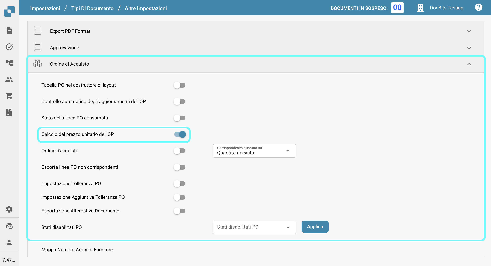

# Calcolo del prezzo unitario dell'OP

## **Panoramica**

Puoi scegliere di calcolare il prezzo unitario manualmente dividendo l'importo netto per la quantità, invece di estrarlo automaticamente dal documento. Questo è particolarmente utile quando il prezzo unitario nell'ordine di acquisto (in Infor) differisce dal prezzo estratto dal documento. Tali discrepanze possono sorgere se uno sconto viene applicato al prezzo unitario nell'ordine di acquisto Infor, mentre il documento applica lo sconto solo all'importo netto.

## **Passaggi di Attivazione**

1.  Naviga su **Impostazioni** -> **Impostazioni Globali** -> **Tipi di Documento**.

    <figure><figcaption></figcaption></figure>
2.  Seleziona il tipo di documento desiderato e fai clic su **Altre Impostazioni**.

    <figure><figcaption></figcaption></figure>
3.  Nella sezione **Ordine di Acquisto**, abilita l'opzione **Calcolo del prezzo unitario dell'OP**.

    <figure><figcaption></figcaption></figure>

## Esempio:

<figure><figcaption></figcaption></figure>

In questo caso, il prezzo unitario (senza lo sconto) viene estratto dal documento, mentre l'ordine di acquisto in Infor memorizza il prezzo unitario con lo sconto applicato. Questo porta a una discrepanza nel prezzo unitario.

Una volta attivata l'impostazione, il prezzo unitario verrà ricalcolato come segue:\
**Prezzo Unitario = Importo Netto ÷ Quantità**\
Questo garantisce che il prezzo unitario sia coerente e corrisponda al valore previsto.
