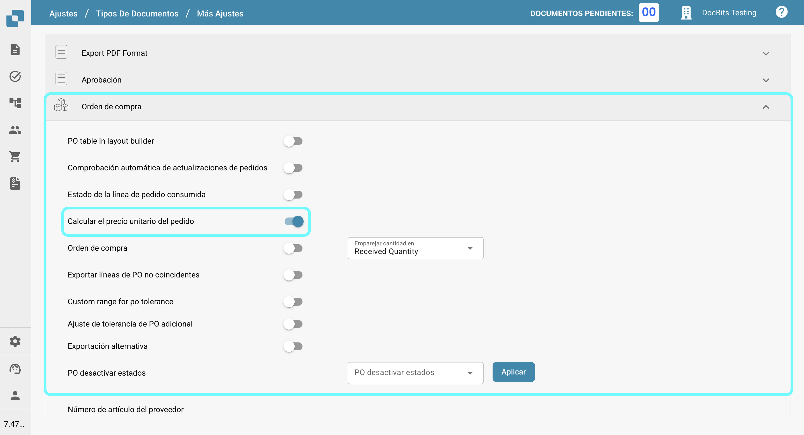

# Calcular el precio unitario del pedido

## **Descripción general**

Puedes optar por calcular el precio unitario manualmente dividiendo el monto neto por la cantidad, en lugar de extraerlo automáticamente del documento. Esto es particularmente útil cuando el precio unitario en la orden de compra (en Infor) difiere del precio extraído del documento. Tales discrepancias pueden surgir si se aplica un descuento al precio unitario en la orden de compra de Infor, mientras que el documento solo aplica el descuento al monto neto.

## **Pasos de activación**

1.  Navega a **Ajustes** -> **Ajustes Globales** -> **Tipos de documentos**.

    <figure><figcaption></figcaption></figure>
2.  Selecciona el tipo de documento deseado y haz clic en **Más Ajustes**.

    <figure><figcaption></figcaption></figure>
3.  En la sección **Orden de compra**, habilita la opción **Calcular el precio unitario del pedido**.

    <figure><figcaption></figcaption></figure>

## Ejemplo:

<figure><figcaption></figcaption></figure>

En este caso, el precio unitario (sin el descuento) se extrae del documento, mientras que la orden de compra en Infor almacena el precio unitario con el descuento aplicado. Esto resulta en una discrepancia en el precio unitario.

Una vez que la configuración esté activada, el precio unitario se recalculará de la siguiente manera:\
**Precio Unitario = Monto Neto ÷ Cantidad**\
Esto asegura que el precio unitario sea consistente y coincida con el valor previsto.
