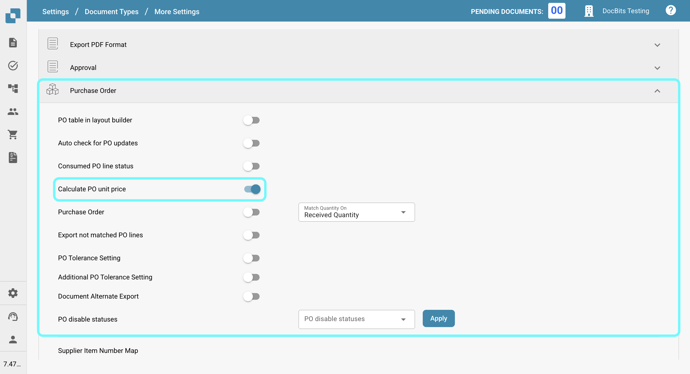

# Calculate PO unit price

## **Overview**

Enabling this setting applies any discount to the unit price and uses the adjusted value for purchase order matching.

**Activation Steps**

1.  Navigate to **Settings** -> **Global Settings** -> **Document Types**.

    <figure><figcaption></figcaption></figure>
2.  Select the desired document type and click on **More Settings**.

    <figure><figcaption></figcaption></figure>
3.  In the **Purchase Order** section, activate the option **Calculate PO Unit Price**.

    <figure><figcaption></figcaption></figure>

Once activated, when you upload a document and access the PO matching screen, the unit price will be adjusted based on any applied discounts and calculated according to the PO match.
