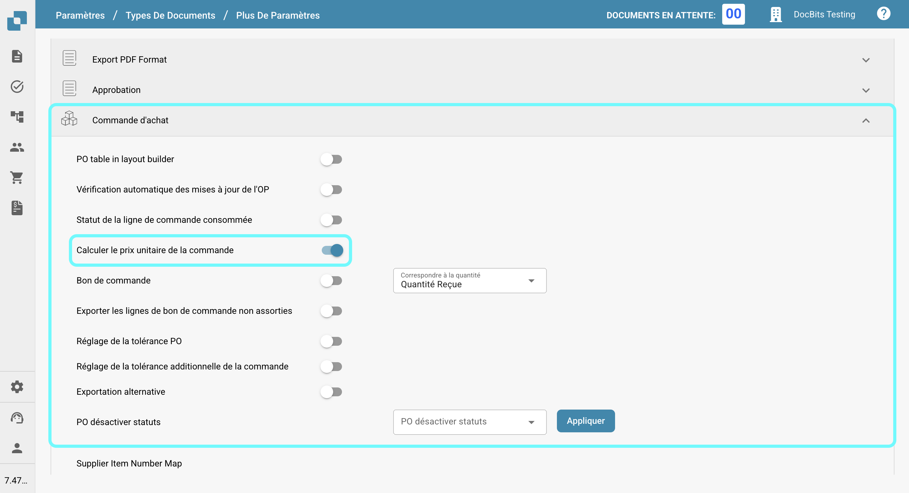

# Calculer le prix unitaire de la commande

## **Aperçu**

Vous pouvez choisir de calculer le prix unitaire manuellement en divisant le montant net par la quantité, au lieu de l'extraire automatiquement du document. Cela est particulièrement utile lorsque le prix unitaire dans la commande d'achat (dans Infor) diffère du prix extrait du document. De telles divergences peuvent survenir si une remise est appliquée au prix unitaire dans la commande d'achat Infor, tandis que le document n'applique la remise qu'au montant net.

## **Étapes d'activation**

1.  Naviguez vers **Paramètres** -> **Paramètres Globaux** -> **Types de documents**.

    <figure><figcaption></figcaption></figure>
2.  Sélectionnez le type de document souhaité et cliquez sur **Plus de Paramètres**.

    <figure><figcaption></figcaption></figure>
3.  Dans la section **Commande d'achat**, activez l'option **Calculer le prix unitaire de la commande**.

    <figure><figcaption></figcaption></figure>

## Exemple:

<figure><figcaption></figcaption></figure>

Dans ce cas, le prix unitaire (sans la remise) est extrait du document, tandis que la commande d'achat dans Infor stocke le prix unitaire avec la remise appliquée. Cela entraîne un décalage dans le prix unitaire.

Une fois le paramètre activé, le prix unitaire sera recalculé comme suit :\
**Prix Unitaire = Montant Net ÷ Quantité**\
Cela garantit que le prix unitaire est cohérent et correspond à la valeur prévue.
