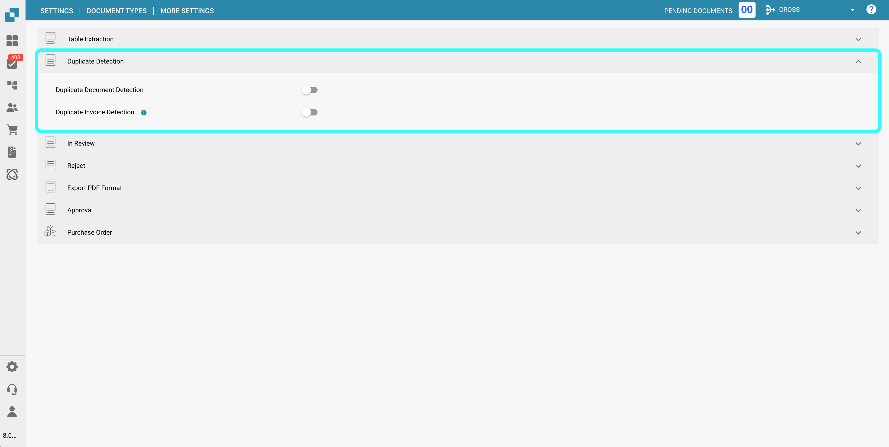
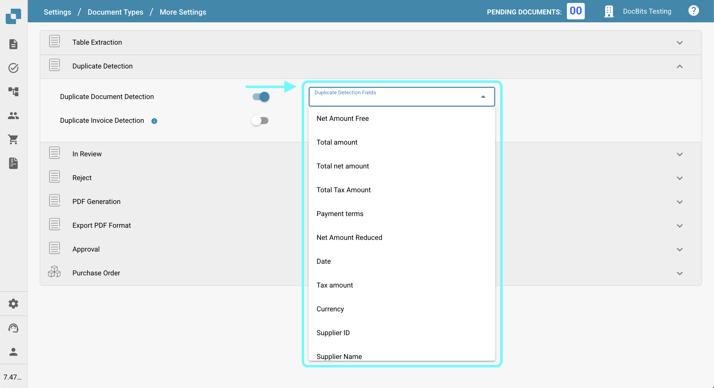
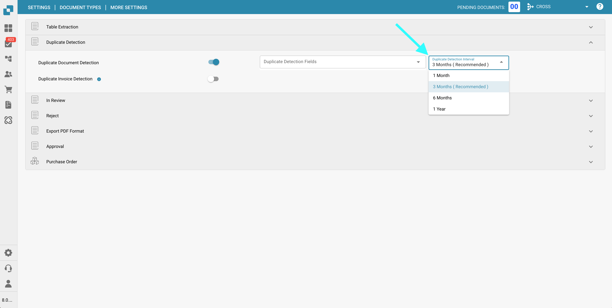
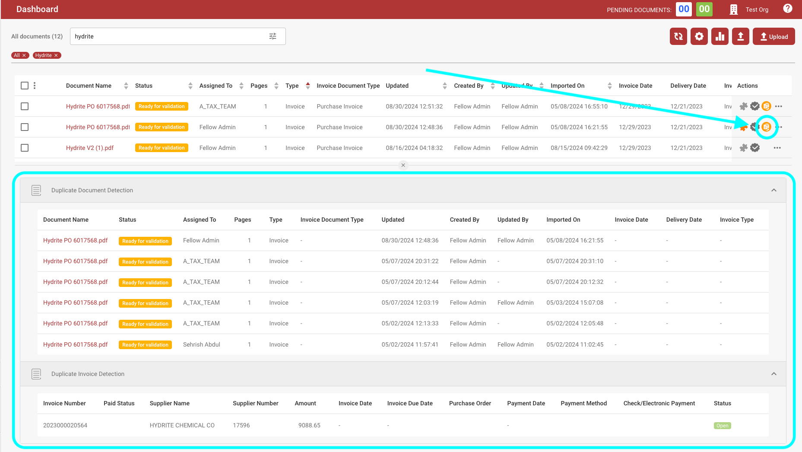
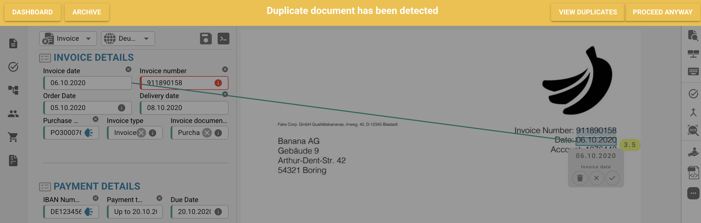

# Duplicate Detection

## Overview

In **DocBits**, you can filter for duplicate documents by specifying which fields must match and by defining a time interval during which duplicates should be detected.

This page provides a detailed guide on how to enable and use the **Duplicate Detection** feature effectively.

## Enabling Duplicate Detection

To enable duplicate document detection in DocBits, follow these steps:

1.  Navigate to **Settings** → **Global Settings** → **Document Types**.

    <figure><figcaption></figcaption></figure>
2.  Select the desired **Document Type** and click on **More Settings**.

    <figure><figcaption></figcaption></figure>
3.  Go to the **Duplicate Detection** section.

    <figure><figcaption></figcaption></figure>

DocBits provides two options for identifying duplicate documents:

1. **Duplicate Document Detection**: \
   This feature checks for duplicate documents uploaded to DocBits based on the selected criteria. If any document matches the selected criteria across other documents, it will be flagged as a duplicate.
2.  **Duplicate Invoice Detection** (Only available for the **Invoice** document type):\
    This feature requires syncing Supplier Invoices from Infor to DocBits. It compares the invoice numbers in the DocBits dashboard with those in Infor. If the same invoice number appears more than once, it will be flagged as a duplicate.

    <mark style="color:red;">**Note**</mark>: Using the **Duplicate Invoice Detection** feature will result in an additional credit charge.

## Filter which documents should be detected as duplicate

Once Duplicate Detection is enabled, you can:

*   Specify Matching Criteria: Choose which attributes should be used to identify duplicates (e.g., supplier id, date, invoice number, etc.).

    <figure><figcaption></figcaption></figure>
*   Set the Detection Interval: Define the time range during which duplicates are detected. Options include:

    * 1 Month
    * 3 Months
    * 6 Months
    * 1 Year

    <figure><figcaption></figcaption></figure>

## Viewing Duplicate Documents on the Dashboard

Once Duplicate Detection is enabled, any documents identified as duplicates will display the **Show Duplicates** icon on the dashboard.

*   Click the **Show Duplicates** icon to open duplicate records in a side-by-side split-screen view for easy comparison.

    <figure><figcaption></figcaption></figure>
*   When viewing a flagged document, a warning bar will appear at the top, indicating that the document is a duplicate.

    <figure><figcaption></figcaption></figure>
