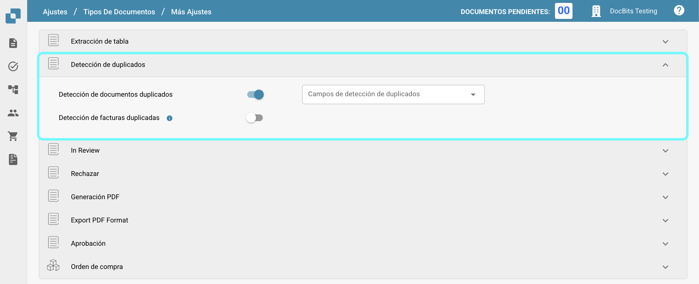
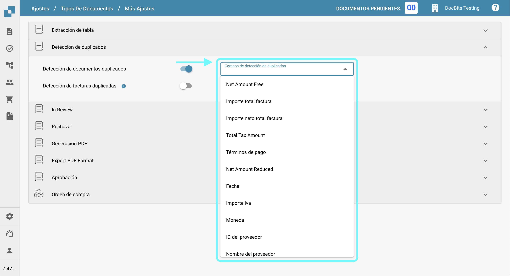
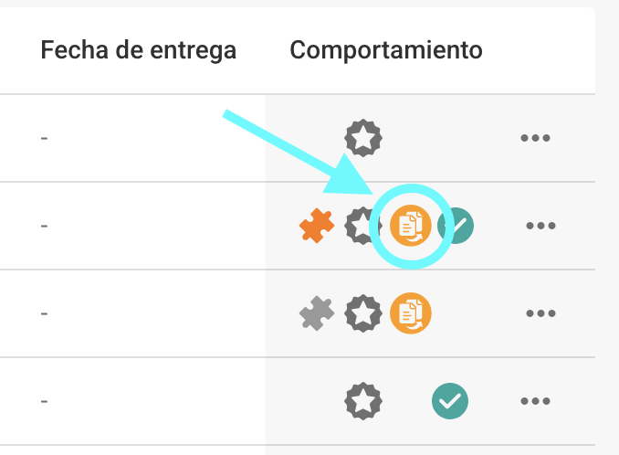
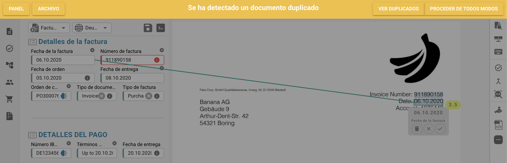

# Detección de duplicados

## Habilitando el Manejo de Documentos Duplicados

Para habilitar el manejo de documentos duplicados, sigue estos pasos:

1.  Navega a **Ajustes** → **Ajustes Globales** → **Tipos de documentos**.

    <figure><figcaption></figcaption></figure>
2.  Selecciona el **Tipo de documento** deseado y haz clic en **Más Ajustes**.

    <figure><figcaption></figcaption></figure>
3.  Ve a la sección de **Detección de duplicados**.

    <figure><figcaption></figcaption></figure>

Tienes dos opciones para detectar documentos duplicados:

1. **Detección de documentos duplicados**:\
   Esta función verifica si hay documentos duplicados subidos a DocBits según los criterios seleccionados. Si algún documento coincide con los criterios seleccionados en otros documentos, se marcará como duplicado.
2.  **Detección de facturas duplicadas** (Solo disponible para el tipo de documento **Factura**):\
    Esta función requiere sincronizar las Facturas de Proveedores de Infor a DocBits. Compara los números de factura en el panel de DocBits con los de Infor. Si el mismo número de factura aparece más de una vez, se marcará como duplicado.

    <mark style="color:red;">**Nota**</mark>: Usar la función de **Detección de facturas duplicadas** resultará en un cargo adicional de crédito.

Una vez que la configuración esté activada, puedes seleccionar los criterios específicos para la detección de duplicados.

<figure><figcaption></figcaption></figure>

## Visualizando Documentos Duplicados en el Panel

Después de habilitar la Detección de Duplicados, el panel mostrará un ícono para cualquier documento identificado como duplicado según los criterios seleccionados. Hacer clic en este ícono abrirá los registros duplicados en una vista de pantalla dividida para una fácil comparación.

<figure><figcaption></figcaption></figure>

<figure><figcaption></figcaption></figure>

Al visualizar un documento, aparecerá una barra de advertencia para indicar que el documento es un duplicado.

<figure><figcaption></figcaption></figure>
