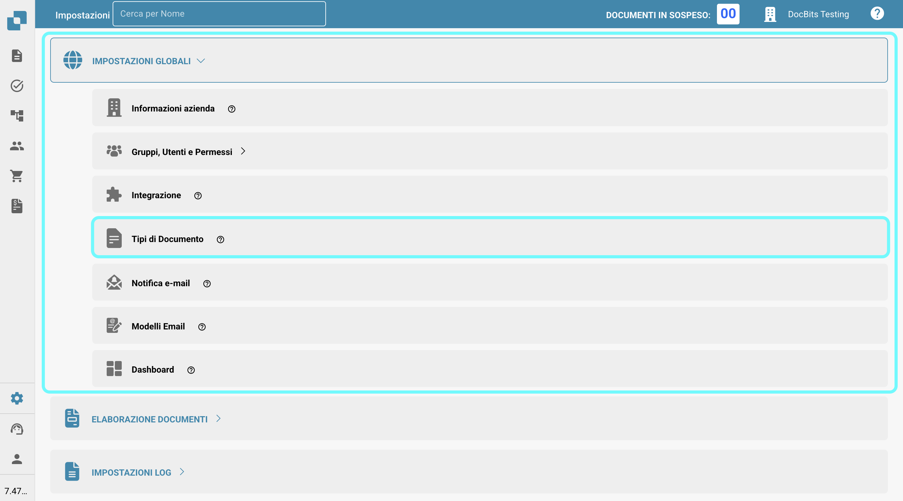
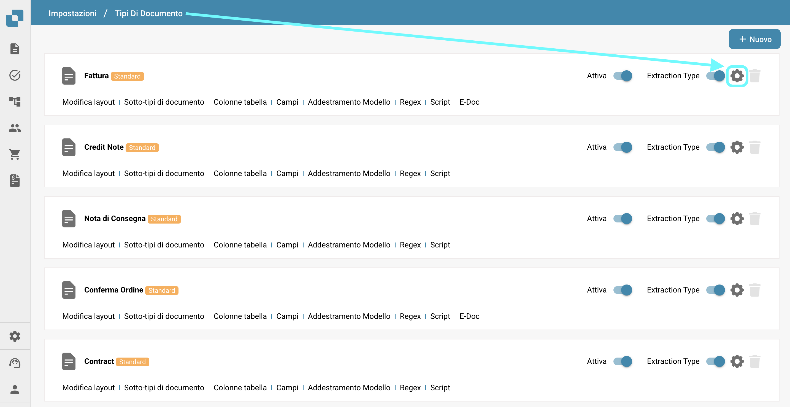
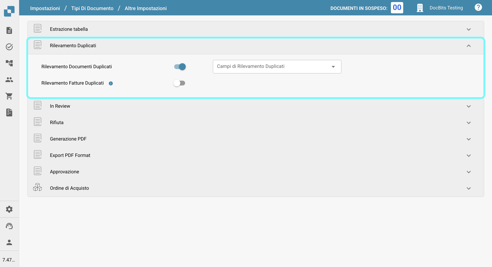
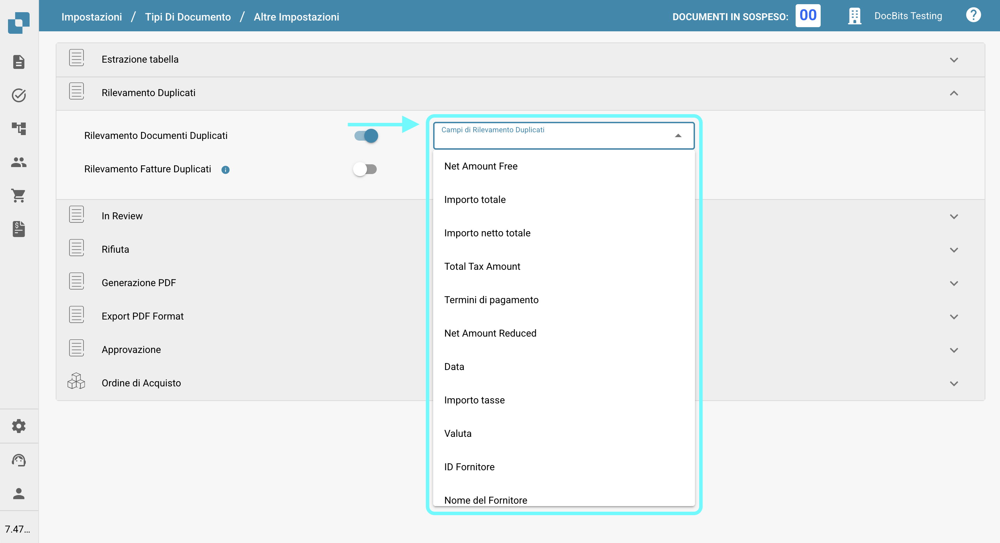
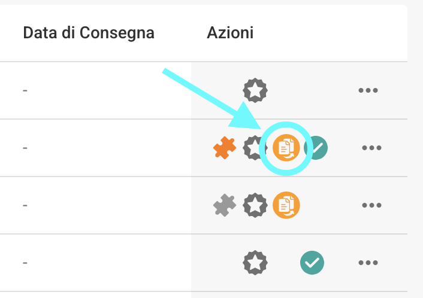
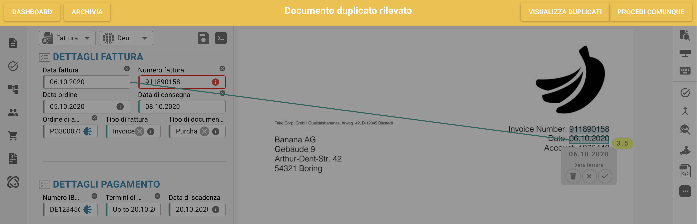

# Rilevamento dei duplicati

## Abilitazione della Gestione Documenti Duplicati

Per abilitare la gestione dei documenti duplicati, segui questi passaggi:

1.  Naviga su **Impostazioni** → **Impostazioni Globali** → **Tipi di Documento**.

    <figure><figcaption></figcaption></figure>
2.  Seleziona il **Tipo di Documento** desiderato e clicca su **Altre Impostazioni**.

    <figure><figcaption></figcaption></figure>
3.  Vai alla sezione **Rilevamento Duplicati**.

    <figure><figcaption></figcaption></figure>

Hai due opzioni per rilevare documenti duplicati:

1. **Rilevamento Documenti Duplicati**:\
   Questa funzione controlla i documenti duplicati caricati su DocBits in base ai criteri selezionati. Se un documento corrisponde ai criteri selezionati rispetto ad altri documenti, verrà contrassegnato come duplicato.
2.  **Rilevamento Fatture Duplicati** (Disponibile solo per il tipo di documento **Fattura**):\
    Questa funzione richiede la sincronizzazione delle Fatture Fornitori da Infor a DocBits. Confronta i numeri di fattura nel dashboard di DocBits con quelli in Infor. Se lo stesso numero di fattura appare più di una volta, verrà contrassegnato come duplicato.

    <mark style="color:red;">**Nota**</mark>: L'uso della funzione **Rilevamento Fatture Duplicati** comporterà un addebito di credito aggiuntivo.

Una volta attivata l'impostazione, puoi selezionare i criteri specifici per il rilevamento dei duplicati.

<figure><figcaption></figcaption></figure>

## Visualizzazione Documenti Duplicati nel Dashboard

Dopo aver abilitato il Rilevamento Duplicati, il dashboard mostrerà un'icona per qualsiasi documento identificato come duplicato in base ai criteri selezionati. Cliccando su questa icona si apriranno i record duplicati in una vista a schermo diviso per un facile confronto.

<figure><figcaption></figcaption></figure>

<figure><figcaption></figcaption></figure>

Quando visualizzi un documento, apparirà una barra di avviso per indicare che il documento è un duplicato.

<figure><figcaption></figcaption></figure>
