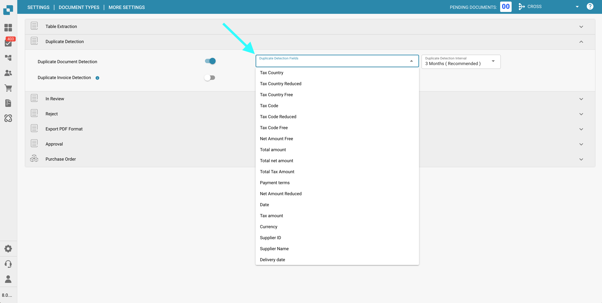

# Obsługa Duplikatów Dokumentów

## Włączanie Obsługi Duplikatów Dokumentów

Aby włączyć obsługę duplikatów dokumentów, wykonaj następujące kroki:

1.  Przejdź do **Ustawienia** → **Ustawienia globalne** → **Typy dokumentów**.

    <figure><figcaption></figcaption></figure>
2.  Wybierz żądany **Typ dokumentu** i kliknij **Więcej ustawień**.

    <figure><figcaption></figcaption></figure>
3.  Przejdź do sekcji **Wykrywanie duplikatów**.

    <figure><figcaption></figcaption></figure>

Masz dwie opcje wykrywania duplikatów dokumentów:

1. **Wykrywanie duplikatów dokumentów**:\
   Ta funkcja sprawdza, czy w DocBits zostały przesłane duplikaty dokumentów na podstawie wybranych kryteriów. Jeśli jakikolwiek dokument pasuje do wybranych kryteriów w innych dokumentach, zostanie oznaczony jako duplikat.
2.  **Wykrywanie duplikatów faktur** (Dostępne tylko dla typu dokumentu **Faktura**):\
    Ta funkcja wymaga synchronizacji faktur dostawców z Infor do DocBits. Porównuje numery faktur w pulpicie DocBits z tymi w Infor. Jeśli ten sam numer faktury pojawi się więcej niż raz, zostanie oznaczony jako duplikat.

    <mark style="color:red;">**UWAGA**</mark><mark style="color:red;">:</mark> Korzystanie z funkcji **Wykrywanie duplikatów faktur** spowoduje dodatkową opłatę kredytową.

Po aktywowaniu ustawienia możesz wybrać konkretne kryteria do wykrywania duplikatów.

<figure><figcaption></figcaption></figure>

## Wyświetlanie Duplikatów Dokumentów na Pulpicie

Po włączeniu Wykrywania Duplikatów, pulpit wyświetli ikonę dla wszelkich dokumentów zidentyfikowanych jako duplikaty na podstawie wybranych kryteriów. Kliknięcie tej ikony otworzy duplikaty w widoku podzielonego ekranu dla łatwego porównania.

<figure><figcaption></figcaption></figure>

<figure><figcaption></figcaption></figure>

Podczas przeglądania dokumentu pojawi się pasek ostrzegawczy, aby wskazać, że dokument jest duplikatem.

<figure><figcaption></figcaption></figure>
