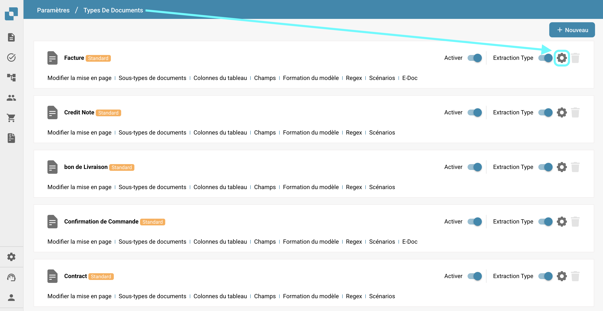
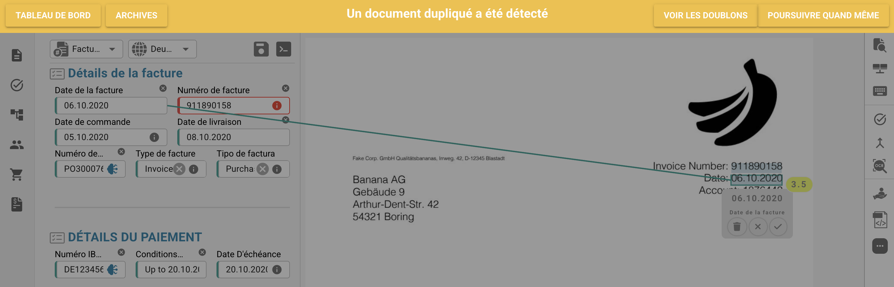

# Détection des doublons

## Activation de la gestion des documents en double

Pour activer la gestion des documents en double, suivez ces étapes :

1.  Accédez à **Paramètres** → **Paramètres Globaux** → **Types de documents**.

    <figure><figcaption></figcaption></figure>
2.  Sélectionnez le **Type de document** souhaité et cliquez sur **Plus de Paramètres**.

    <figure><figcaption></figcaption></figure>
3.  Allez à la section **Détection des doublons**.

    <figure><figcaption></figcaption></figure>

Vous avez deux options pour détecter les documents en double :

1. **Détection des documents en double** :\
   Cette fonctionnalité vérifie les documents en double téléchargés sur DocBits en fonction des critères sélectionnés. Si un document correspond aux critères sélectionnés parmi d'autres documents, il sera signalé comme un doublon.
2.  **Détection des factures en double** (Disponible uniquement pour le type de document **Facture**) :\
    Cette fonctionnalité nécessite la synchronisation des factures fournisseurs d'Infor vers DocBits. Elle compare les numéros de facture dans le tableau de bord DocBits avec ceux d'Infor. Si le même numéro de facture apparaît plus d'une fois, il sera signalé comme un doublon.

    <mark style="color:red;">**Remarque**</mark> : L'utilisation de la fonctionnalité **Détection des factures en double** entraînera un frais de crédit supplémentaire.

Une fois le paramètre activé, vous pouvez sélectionner les critères spécifiques pour la détection des doublons.

<figure><figcaption></figcaption></figure>

## Visualisation des documents en double sur le tableau de bord

Après avoir activé la Détection des doublons, le tableau de bord affichera une icône pour tous les documents identifiés comme des doublons en fonction des critères sélectionnés. En cliquant sur cette icône, vous ouvrirez les enregistrements en double dans une vue à écran partagé pour une comparaison facile.

<figure><figcaption></figcaption></figure>

<figure><figcaption></figcaption></figure>

Lors de la visualisation d'un document, une barre d'avertissement apparaîtra pour indiquer que le document est un doublon.

<figure><figcaption></figcaption></figure>
