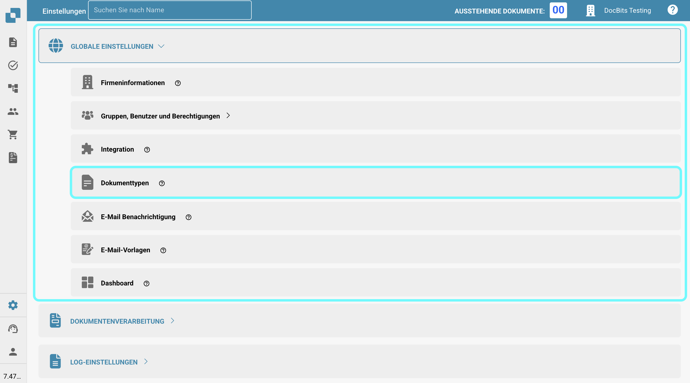

# Erkennung von doppelten Dokumenten

## Aktivierung der Erkennung von doppelten Dokumenten

Um die Erkennung von doppelten Dokumenten zu aktivieren, folgen Sie diesen Schritten:

1.  Navigieren Sie zu **Einstellungen** → **Globale Einstellungen** → **Dokumenttypen**.

    <figure><figcaption></figcaption></figure>
2.  Wählen Sie den gewünschten **Dokumenttyp** aus und klicken Sie auf **Weitere Einstellungen**.

    <figure><figcaption></figcaption></figure>
3.  Gehen Sie zum Abschnitt **Erkennung von Duplikaten**.

    <figure><figcaption></figcaption></figure>

Sie haben zwei Optionen zur Erkennung von doppelten Dokumenten:

1. **Erkennung von doppelten Dokumenten**:\
   Diese Funktion überprüft, ob doppelte Dokumente, die in DocBits hochgeladen wurden, basierend auf den ausgewählten Kriterien vorhanden sind. Wenn ein Dokument mit den ausgewählten Kriterien in anderen Dokumenten übereinstimmt, wird es als Duplikat gekennzeichnet.
2.  **Erkennung doppelter Rechnungen** (Nur verfügbar für den **Rechnung** Dokumenttyp):\
    Diese Funktion erfordert das Synchronisieren von Lieferantenrechnungen aus Infor zu DocBits. Sie vergleicht die Rechnungsnummern im DocBits-Dashboard mit denen in Infor. Wenn dieselbe Rechnungsnummer mehr als einmal erscheint, wird sie als Duplikat gekennzeichnet.

    <mark style="color:red;">**HINWEIS**</mark><mark style="color:red;">:</mark> Die Verwendung der Funktion **Erkennung doppelter Rechnungen** führt zu einer zusätzlichen Gutschriftgebühr.

Sobald die Einstellung aktiviert ist, können Sie die spezifischen Kriterien für die Erkennung von Duplikaten auswählen.

<figure><figcaption></figcaption></figure>

## Anzeigen von doppelten Dokumenten im Dashboard

Nachdem die Erkennung von Duplikaten aktiviert wurde, zeigt das Dashboard ein Symbol für alle Dokumente an, die basierend auf den ausgewählten Kriterien als Duplikate identifiziert wurden. Ein Klick auf dieses Symbol öffnet die doppelten Datensätze in einer geteilten Bildschirmansicht für einen einfachen Vergleich.

<figure><figcaption></figcaption></figure>

<figure><figcaption></figcaption></figure>

Beim Anzeigen eines Dokuments erscheint eine Warnleiste, die darauf hinweist, dass das Dokument ein Duplikat ist.

<figure><figcaption></figcaption></figure>
