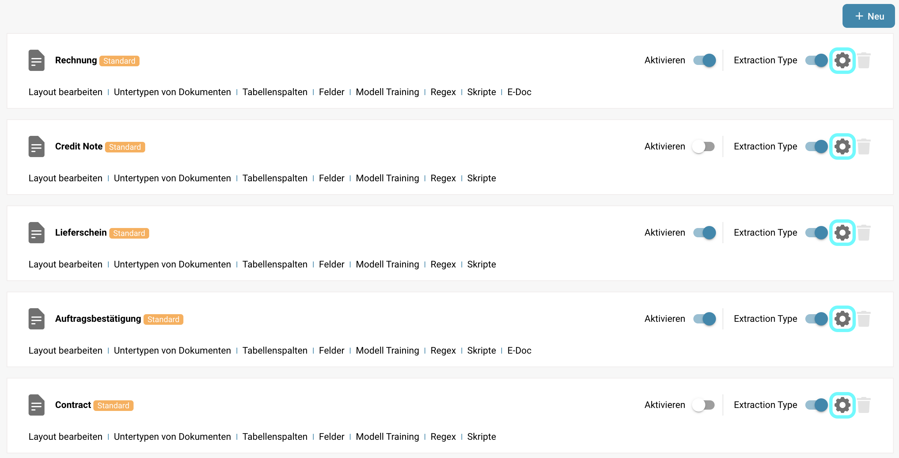
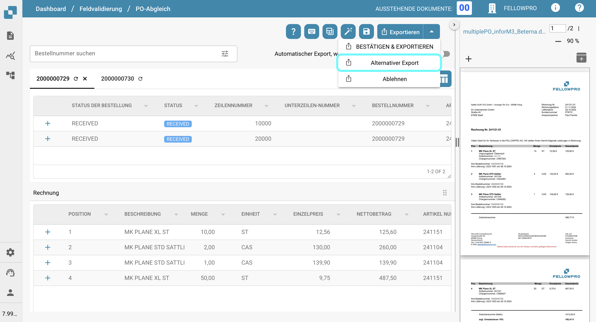

# Alternativer Export

## Übersicht

Sie können eine alternative Exportoption konfigurieren, die im Dropdown-Menü für den Export im Bereich der Bestellnummer angezeigt wird, wenn ein Dokument einen bestimmten Status hat.\
Diese Seite erklärt, wie Sie diese Option einrichten.

## Aktivierungsschritte

1. Gehen Sie zu **Einstellungen** -> **Globale Einstellungen** -> **Dokumenttypen**
2.  Wählen Sie den gewünschten Dokumenttyp aus und klicken Sie auf **Weitere Einstellungen**.

    
3.  Im Bereich **Bestellnummer** navigieren Sie zur Option **Alternativer Export**.

    

## So richten Sie es ein

Sobald die Einstellung aktiviert ist, können Sie einen Dokumentstatus auswählen und eine vordefinierte Exportkonfiguration zuweisen.

Weitere Informationen zur Einrichtung von Exportkonfigurationen finden Sie [hier](../../../../../../admin-section/settings/document-processing/export.md).

Sie können zwischen den folgenden Status wählen:

* Klassifiziert
* Bestätigung steht noch aus
* Genehmigung ausstehend
* Zweite Genehmigung ausstehend
* Validiert, zum Export anstehend
* Genehmigt und zur Ausfuhr vorgesehen
* Abgelehnt
* Exportiert
* In der Warteschleife
* Workflow
* Fehler
* In Überprüfung

Nach der Einrichtung wird eine zusätzliche Exportoption im Bereich der Bestellnummer angezeigt, die mit den Exportoptionen übereinstimmt. Diese Option verwendet die angegebene Exportkonfiguration, wenn das Dokument den definierten Status erfüllt.

