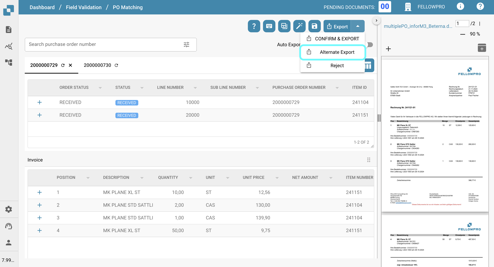

# Alternate Export

## Overview

You can configure an alternate export option to appear in the export dropdown within the purchase order section when a document is in a specific status.\
This page explains how to set up this option.

## Activation Steps

1. Go to **Settings** -> **Global Settings** -> **Document Types**
2.  Select the desired document type and click on **More Settings**.

    <figure><figcaption></figcaption></figure>
3.  In the **Purchase Order** section, navigate to the **Alternate Export** option.

    <figure><figcaption></figcaption></figure>

## How to set up

Once the setting is enabled, you can choose a document status and assign a predefined export configuration.

More information on setting up export configurations can be found [here](../../../../document-processing/export.md).

You can choose between the following statuses:

* Classified
* Pending conformation
* Pending approval
* Pending second approval
* Validated, pending export
* Approved pending export
* Rejected
* Exported
* On hold
* Workflow
* Error
* In Review

After setup, an additional export option will appear in the purchase order matching export options. This option uses the specified export configuration when the document matches the defined status.

<figure><figcaption></figcaption></figure>

