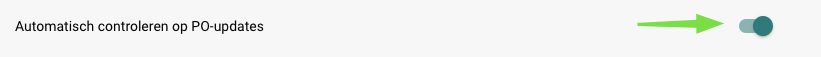

# Automatische controle op PO-updates

#### Waar te Vinden

Ga naar **Instellingen** → **Algemene Instellingen** → **Documenttypen** → **Meer Instellingen** → **Aankooporder Sectie** → **Automatische Controle op PO-updates** Zet de knop om deze instelling in te schakelen.

<figure><figcaption></figcaption></figure>

#### Hoe Het Werkt

Wanneer ingeschakeld, biedt het systeem een **visuele indicator** in het **Aankooporder Matching** scherm telkens wanneer een aankooporder is bijgewerkt. Dit pictogram geeft aan dat de aankooporder moet worden vernieuwd om ervoor te zorgen dat gebruikers werken met de meest **actuele informatie** voordat ze beslissingen nemen.

Om de aankooporder te vernieuwen, klik je op het **ververspictogram** naast het aankoopordernummer (zie afbeelding hieronder).

.png>)
