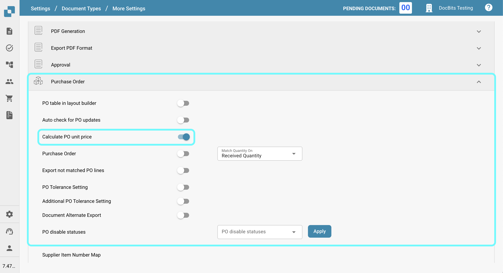

# Calculate PO unit price

## **Overview**

You can choose to automatically calculate the **unit price** by dividing the **total amount** by the **quantity**, and then multiplying it by the **unit price per** value, instead of extracting the unit price directly from the document. This is particularly useful when the unit price in the purchase order (in Infor) differs from the price extracted from the document. Such discrepancies may arise if a discount is applied to the unit price in the Infor purchase order, while the document only applies the discount to the net amount.

## **Activation Steps**

1.  Navigate to **Settings** -> **Global Settings** -> **Document Types**.

    <figure><figcaption></figcaption></figure>
2.  Select the desired document type and click on **More Settings**.

    <figure><figcaption></figcaption></figure>
3.  In the **Purchase Order** section, enable the option **Calculate PO Unit Price**.

    <figure><figcaption></figcaption></figure>

## Example:

<figure><figcaption></figcaption></figure>

In this case, the unit price (without the discount) is extracted from the document, while the purchase order in Infor stores the unit price with the discount applied. This results in a mismatch in the unit price.

Once the setting is activated, the unit price will be recalculated as follows:\
&#xNAN;**`Unit Price = Total Amount ÷ Quantity * Unit Price Per`**\
This ensures that the unit price is consistent and matches the intended value.
