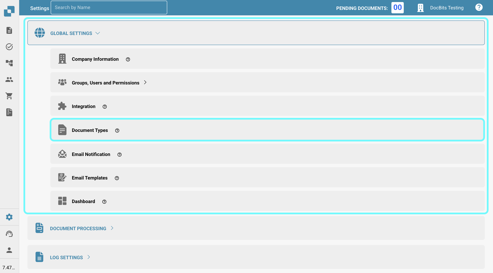
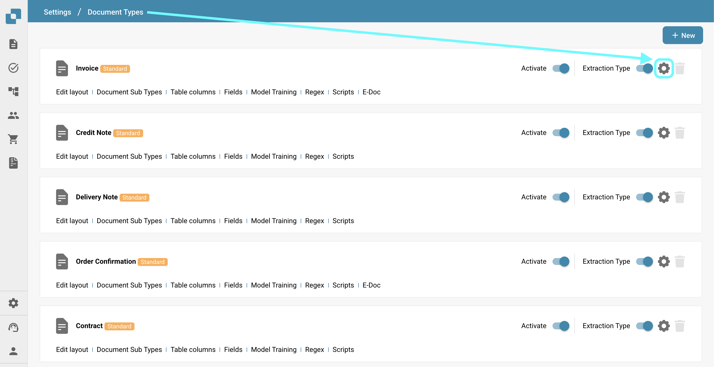
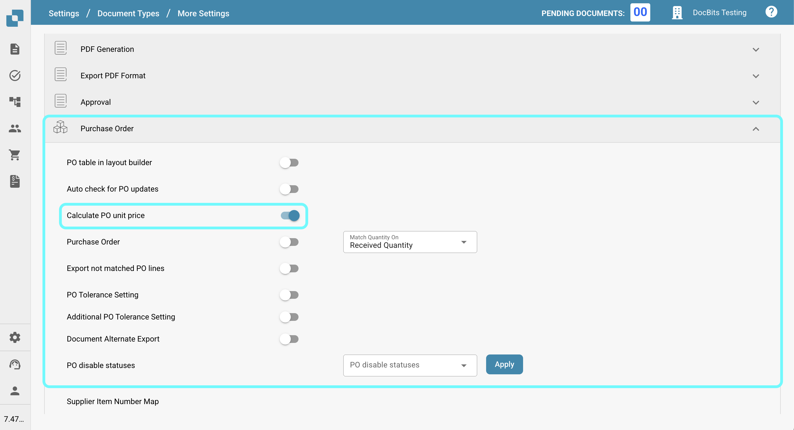
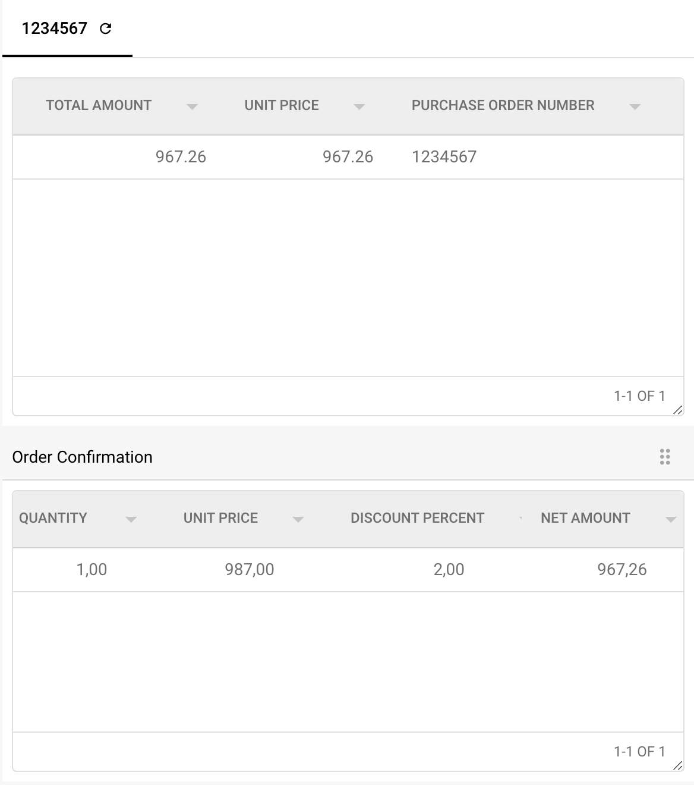

# Satın Alma Siparişi birim fiyatını hesapla

## **Genel Bakış**

Satın alma siparişi satırındaki **tutar** ve **miktar**dan her satın alma siparişi satırının **birim fiyatını** otomatik olarak hesaplamayı seçebilirsiniz; böylece satın alma siparişi ile gelen birim fiyat kullanılmaz. Bu, özellikle satın alma siparişlerindeki birim fiyat (Infor ERP / SAP içinde) ile belgede yer alan fiyat farklı olduğunda faydalıdır. Böyle tutarsızlıklar, satın alma siparişindeki birim fiyata indirim uygulanırken, belgede indirimin yalnızca net tutara uygulanması durumunda ortaya çıkabilir.

## **Aktivasyon Adımları**

1.  **Ayarlar** -> **Genel Ayarlar** -> **Belge Türleri** yolunu izleyin.

    <figure><figcaption></figcaption></figure>
2.  İstediğiniz belge türünü seçin ve **Daha Fazla Ayar** butonuna tıklayın.

    <figure><figcaption></figcaption></figure>
3.  **Satın Alma Siparişi** bölümünde, **Satın Alma Siparişi Birim Fiyatını Hesapla** seçeneğini etkinleştirin.

    <figure><figcaption></figcaption></figure>

## Fiyatın nasıl hesaplandığı

Ayar etkinleştirildiğinde, bir satın alma siparişi satırının birim fiyatı şu şekilde hesaplanır:

**`Birim Fiyat = Satır Tutarı ÷ Miktar × Birim Fiyat Başına`**

burada **satır tutarı** şu şekilde seçilir:

| Satın alma siparişi satırı taşır                                                               | Kullanılan satır tutarı                 |
| ---------------------------------------------------------------------------------------------- | -------------------------------------- |
| 0'dan büyük ve satır toplamını aşmayan bir **net tutar** (`extended_amount`)                    | net tutar                              |
| net tutar yok veya satır toplamını aşan net tutar                                              | satır **toplamı** (`total_amount`)     |
| pozitif tutar veya pozitif miktar yok                                                          | hesaplama yapılmaz, satın alma fiyatı kalır |

Net tutarın önce gelmesinin sebebi: ERP beslemeleri (Infor BODs) net satır tutarını `extended_amount` olarak gönderir ve **vergi ve masrafları üstte** `total_amount` içinde taşır. Vergili toplamı miktara bölmek, brüt birim fiyat verir ve net fiyatlandırılan her fatura _birim fiyat uyumsuzluğu_ gösterir, oysa fiyat doğrudur. Gerçek bir satın alma siparişi satırından örnek: miktar 9, net tutar 879.84, toplam 954.63 (%8.5 vergi) — net bazlı fiyat 97.76 ve faturayla eşleşir; toplam bazlı fiyat ise 106.07 olur.

Satır toplamından **büyük** olan bir net tutar net tutar olamaz, bu durumda toplam kullanılır. `Birim Fiyat Başına` değeri 0 veya boş ise 1 olarak sayılır.


Hesaplanan fiyat, belge üzerinde saklanan satın alma siparişi anlık görüntüsüne yazılır ve **belge her eşleştiğinde yeniden hesaplanır** (Otomatik PO Eşleştirme, manuel eşleştirme, kaydetme sırasında eşleştirme). Ayar değişmeden önce eşleştirilmiş bir belge, bir sonraki eşleşmesinde yeni fiyatı alır — satın alma siparişinin yeniden yüklenmesine gerek yoktur.


## Örnek:

<figure><figcaption></figcaption></figure>

Bu durumda, birim fiyat (indirim olmadan) belgeden alınırken, ERP’deki satın alma siparişi birim fiyatı indirim uygulanmış olarak saklar. Bu, birim fiyat uyumsuzluğuna yol açar. Ayar etkinleştirildiğinde, birim fiyat yerine satır tutarı ve miktardan alınır, böylece her iki taraf da uyumlu olur.

## İlgili ayarlar

* [Satın Alma Siparişi Eşleştirme Kuralları](purchase-order-matching-rules.md) — kurallar, ayar açıkken bu hesaplanan fiyat olan **etkin** birim fiyatı karşılaştırır.
* [Satın Alma Siparişi Tolerans Ayarları](purchase-order-tolerance-settings-additional-purchase-order-tolerance.md) — fatura fiyatının hesaplanan fiyattan ne kadar sapabileceği.