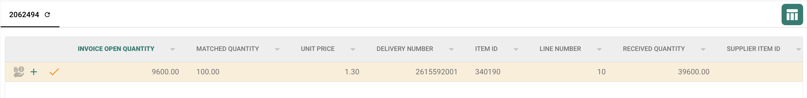

# Consumed PO Line Status

## **Overview**

This setting enhances the **Purchase Order Matching** screen by applying color coding to PO lines. It provides a quick visual understanding of the matching status for each line.

## Where to Activate

1. Go to: **Settings** → **Global Settings** → **Document Type**
2.  Select the desired document type and click on **More Settings**.\\

    <figure><figcaption></figcaption></figure>
3.  In the **Purchase Order** section, navigate to the **Update Document Purchase Order Status** option.\\

    <figure><figcaption></figcaption></figure>

## **What the Colors Mean**

*   **White** – The PO line has **not been matched** yet.

    
<figure><figcaption></figcaption></figure>

*   **Blue** – The PO line has been **selected by the user** for matching.

    
<figure><figcaption></figcaption></figure>

*   **Yellow** – The PO line is **partially matched**; there is still quantity available for matching.

    
<figure><figcaption></figcaption></figure>

*   **Pink** – The PO line is **fully matched**; no remaining quantity is available for further matching.\\

    
<figure><figcaption></figcaption></figure>

