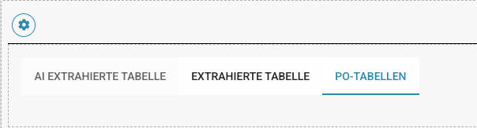
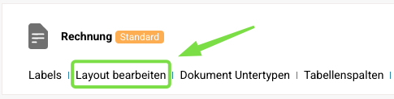
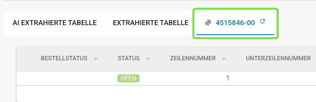

# Auftragstabelle im Layout-Builder

Diese Einstellung steuert die Zugänglichkeit der **Auftragsübersicht (PO) Tabelle** im **Layout Builder** und im **Validierungsbildschirm**.

### **So aktivieren Sie die** Auftragstabelle

Um diese Funktion zu aktivieren:

* Gehen Sie zu **Einstellungen → Allgemeine Einstellungen → Dokumenttypen → Weitere Einstellungen → Bestellung → PO-Tabelle im Layout Builder**.
* Aktivieren Sie die Einstellung, um die **Auftragstabelle Tabelle** sichtbar zu machen.

<figure><figcaption></figcaption></figure>

### **Funktionalität:**

* **Wenn aktiviert**:
  * Die **Bestellübersicht Tabelle** erscheint im **Tabellenbereich** im **Layout Builder**.
  *   Es wird keine Benachrichtigung angezeigt, dass das Modul deaktiviert ist.\

      <figure><figcaption></figcaption></figure>
* **Wenn deaktiviert**:
  * Ein Hinweis zeigt an, dass das Modul deaktiviert ist.
  *   Die **PO-Tabelle** wird im **Validierungsbildschirm** nicht sichtbar sein.\

      <figure><figcaption></figcaption></figure>

**So greifen Sie auf den Layout Builder zu**

* Navigieren Sie zu **Einstellungen → Allgemeine Einstellungen → Dokumenttypen → Layout bearbeiten**.

<figure><figcaption></figcaption></figure>

### **Hinzufügen der PO-Tabelle zurück zum Layout**

Wenn die **PO-Tabelle** fehlt oder entfernt wurde, befolgen Sie diese Schritte:

* Öffnen Sie den **Layout Builder**.
* Wählen Sie unter **Formularelemente** **Extrahierte Tabellen** aus.
* Fügen Sie die **PO-Tabelle** zu Ihrem Layout hinzu.

<figure><figcaption></figcaption></figure>

Sobald hinzugefügt und aktiviert, wird die **PO-Tabelle** im **Layout Builder** und im **Validierungsbildschirm** sichtbar sein, wenn eine **Bestellung** für eine Rechnung verfügbar ist.

<figure><figcaption></figcaption></figure>

​
