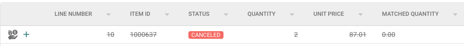
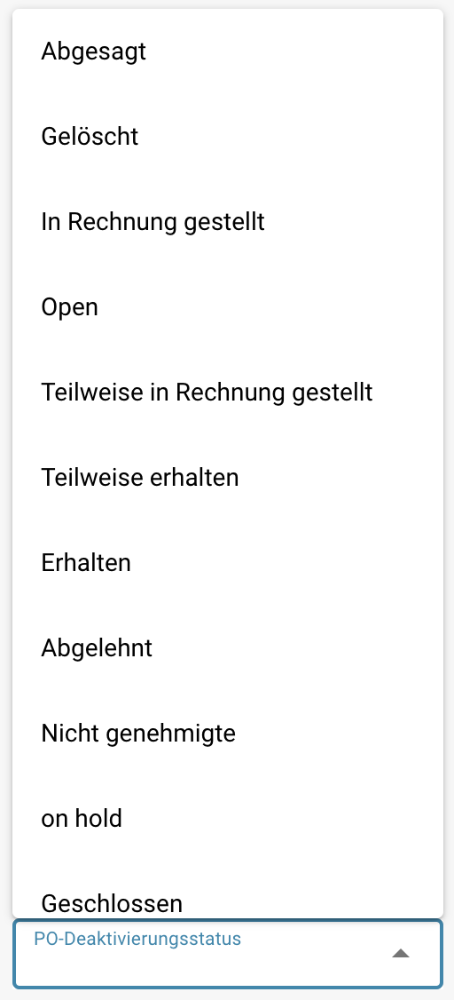

# PO-Deaktivierungsstatus

## **Übersicht**

Die **PO-Deaktivierungsstatus**-Einstellung ermöglicht es Benutzern, Bestellstatus (PO) anzugeben, die verhindern, dass Rechnungen mit diesen POs abgeglichen werden. Wenn eine Bestellung einen in dieser Einstellung aufgeführten Status hat, **kann** sie nicht für den Rechnungsabgleich im PO-Abgleichsbildschirm verwendet werden, was die weitere Verarbeitung der zugehörigen Rechnungen stoppt, bis sich der Status der PO in einen nicht deaktivierten Status ändert.\
\
Durch die Verwendung dieser Einstellung können Benutzer sicherstellen, dass Bestellungen mit bestimmten Status nicht weiter bearbeitet werden, wodurch Fehler reduziert und unnötige Zahlungen verhindert werden.

## **Aktivierungsschritte**

1.  Gehe zu **Einstellungen → Globale Einstellungen → Dokumenttypen**

    <figure><figcaption></figcaption></figure>
2.  Wähle den gewünschten Dokumenttyp aus und klicke auf **Weitere Einstellungen**.

    <figure><figcaption></figcaption></figure>
3.  Im Abschnitt **Bestellung** navigiere zur Option **PO-Deaktivierungsstatus**.

    <figure><figcaption></figcaption></figure>

### **Wie man eine deaktivierte Bestellung identifiziert**

Im **PO-Abgleich**-Bildschirm erscheint eine deaktivierte Bestellung **durchgestrichen**. Dies zeigt visuell an, dass die PO derzeit aufgrund ihres Status nicht abgeglichen werden kann.

<figure><figcaption></figcaption></figure>

### **Wie man es einrichtet**

1. In der **PO-Deaktivierungsstatus**-Einstellung siehst du ein Auswahlfeld auf der linken Seite.
2.  Ein Klick auf dieses Feld öffnet eine Dropdown-Liste mit verfügbaren PO-Status.

    <figure><figcaption></figcaption></figure>
3. Wähle einen oder mehrere Status aus, indem du auf sie klickst. Klicke erneut, um die Auswahl aufzuheben.
4.  Klicke auf die Schaltfläche **Anwenden**, um deine Änderungen zu speichern.

    <figure><figcaption></figcaption></figure>

**Verfügbare Status**

* Abgesagt
* Gelöscht
* In Rechnung gestellt
* Open
* Teilweise in Rechnung gestellt
* Teilweise erhalten
* Erhalten
* Abgelehnt
* Nicht genehmigt
* on hold
* Geschlossen
