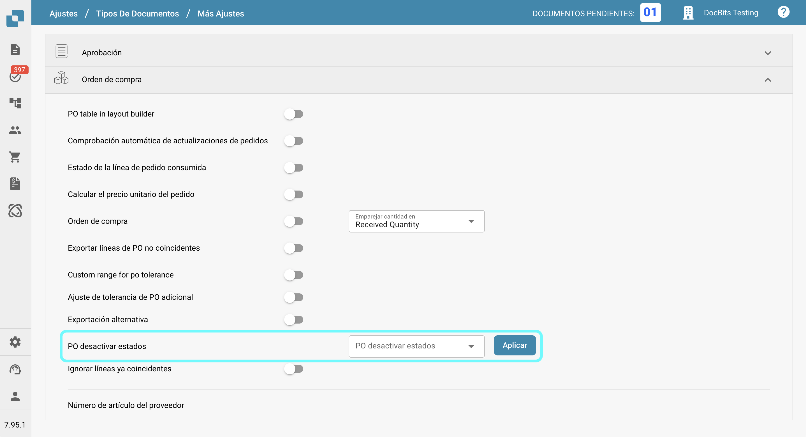
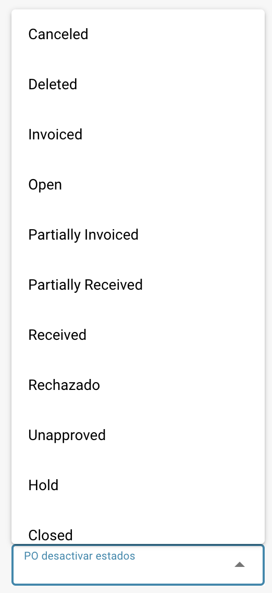

# PO desactivar estados

## **Descripción general**

La configuración de **PO Desactivar Estados** permite a los usuarios especificar estados de órdenes de compra (PO) que impiden que las facturas se emparejen con esas POs. Si una orden de compra tiene un estado listado en esta configuración, **no puede** ser utilizada para el emparejamiento de facturas en la pantalla de emparejamiento de PO, deteniendo el procesamiento de facturas relacionadas hasta que el estado de la PO cambie a uno que no esté deshabilitado.\
\
Al utilizar esta configuración, los usuarios pueden asegurarse de que las órdenes de compra con estados específicos no pasen por un procesamiento adicional de facturas, reduciendo errores y evitando pagos innecesarios.

## **Pasos de activación**

1.  Ir a **Ajustes → Ajustes globales → Tipos de documentos**

    <figure><figcaption></figcaption></figure>
2.  Seleccionar el tipo de documento deseado y hacer clic en **Más ajustes**

    <figure><figcaption></figcaption></figure>
3.  En la sección de **Orden de compra**, navegar a la opción de **PO Desactivar Estados**.

    <figure><figcaption></figcaption></figure>

### **Cómo identificar una orden de compra deshabilitada**

En la pantalla de **Emparejamiento de PO**, una orden de compra deshabilitada aparece **tachada**. Esto indica visualmente que la PO está actualmente restringida para ser emparejada debido a su estado.

<figure><figcaption></figcaption></figure>

### **Cómo configurarlo**

1. En la configuración de **PO Desactivar Estados**, verás un campo de selección en el lado izquierdo.
2.  Hacer clic en este campo abre una lista desplegable de estados de PO disponibles.

    <figure><figcaption></figcaption></figure>
3. Selecciona uno o más estados haciendo clic en ellos. Haz clic nuevamente para deseleccionar.
4.  Haz clic en el botón **Aplicar** para guardar tus cambios.

    <figure><figcaption></figcaption></figure>

**Estados disponibles**

* Canceled
* Deleted
* Invoiced
* Open
* Partially Invoiced
* Partially Received
* Received
* Rejected
* Unapproved
* Hold
* Closed
