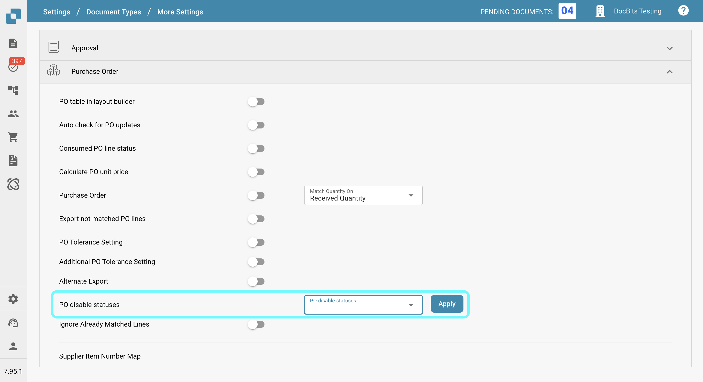
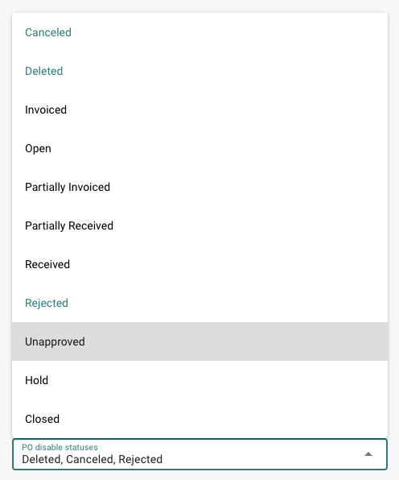
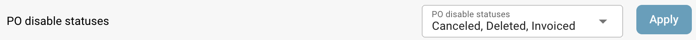

# Statuses de desativação de pedidos de compra

## **Visão Geral**

A configuração **Statuses de Desativação de PO** permite que os usuários especifiquem statuses de pedidos de compra (PO) que impedem que faturas sejam correspondidas a esses POs. Se um pedido de compra tiver um status listado nesta configuração, ele **não pode** ser usado para correspondência de faturas na tela de correspondência de PO, interrompendo o processamento de faturas relacionadas até que o status do PO mude para um que não esteja desativado.\
\
Ao usar esta configuração, os usuários podem garantir que pedidos de compra com statuses específicos não passem por processamento adicional de faturas, reduzindo erros e prevenindo pagamentos desnecessários.

## **Passos de Ativação**

1.  Vá para **Configurações → Configurações Globais → Tipos de Documentos**

    <figure><figcaption></figcaption></figure>
2.  Selecione o tipo de documento desejado e clique em **Mais Configurações**.

    <figure><figcaption></figcaption></figure>
3.  Na seção **Pedido de Compra**, navegue até a opção **Statuses de Desativação de PO**.

    <figure><figcaption></figcaption></figure>

### **Como Identificar um Pedido de Compra Desativado**

Na tela de **Correspondência de PO**, um pedido de compra desativado aparece **riscado**. Isso indica visualmente que o PO está atualmente restrito de ser correspondido devido ao seu status.

<figure><figcaption></figcaption></figure>

### **Como configurá-lo**

1. Na configuração **Statuses de Desativação de PO**, você verá um campo de seleção no lado esquerdo.
2.  Clicar neste campo abre uma lista suspensa de statuses de PO disponíveis.

    <figure><figcaption></figcaption></figure>
3. Selecione um ou mais statuses clicando neles. Clique novamente para desmarcar.
4.  Clique no botão **Aplicar** para salvar suas alterações.

    <figure><figcaption></figcaption></figure>

**Statuses Disponíveis**

* Cancelado
* Excluído
* Faturado
* Aberto
* Parcialmente Faturado
* Parcialmente Recebido
* Recebido
* Rejeitado
* Não Aprovado
* Hold
* Fechado
