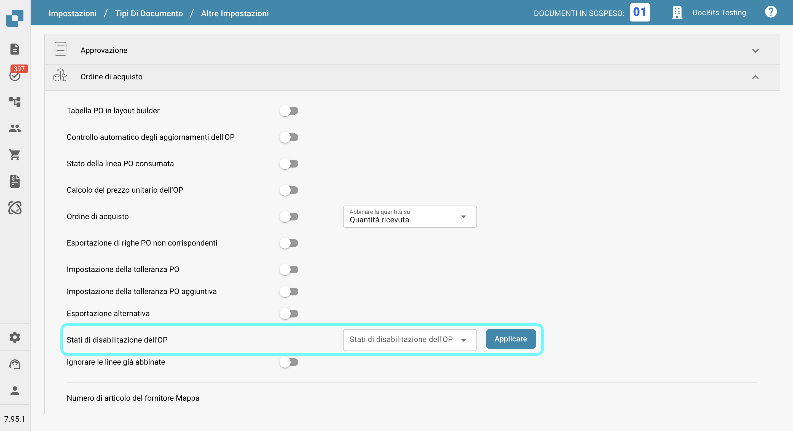
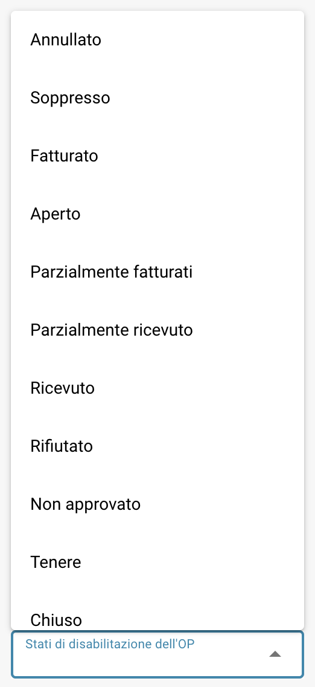

# Stati di disabilitazione dell'OP

## **Panoramica**

L'impostazione **Stati di disabilitazione dell'OP** consente agli utenti di specificare gli stati degli ordini di acquisto (OP) che impediscono l'abbinamento delle fatture a quegli OP. Se un ordine di acquisto ha uno stato elencato in questa impostazione, **non può** essere utilizzato per l'abbinamento delle fatture nella schermata di abbinamento OP, bloccando ulteriori elaborazioni delle fatture correlate fino a quando lo stato dell'OP non cambia in uno stato che non è disabilitato.\
\
Utilizzando questa impostazione, gli utenti possono garantire che gli ordini di acquisto con stati specifici non subiscano ulteriori elaborazioni delle fatture, riducendo gli errori e prevenendo pagamenti non necessari.

## **Passi di attivazione**

1.  Vai a **Impostazioni → Impostazioni globali → Tipi di documenti**

    <figure><figcaption></figcaption></figure>
2.  Seleziona il tipo di documento desiderato e fai clic su **Altre impostazioni**.

    <figure><figcaption></figcaption></figure>
3.  Nella sezione **Ordine di acquisto**, vai all'opzione **Stati di disabilitazione dell'OP**.

    <figure><figcaption></figcaption></figure>

### **Come identificare un ordine di acquisto disabilitato**

Nella schermata **Abbinamento OP**, un ordine di acquisto disabilitato appare **sbarrato**. Questo indica visivamente che l'OP è attualmente limitato nell'essere abbinato a causa del suo stato.

<figure><figcaption></figcaption></figure>

### **Come configurarlo**

1. Nella impostazione **Stati di disabilitazione dell'OP**, vedrai un campo di selezione sul lato sinistro.
2.  Facendo clic su questo campo si apre un elenco a discesa degli stati OP disponibili.

    <figure><figcaption></figcaption></figure>
3. Seleziona uno o più stati facendo clic su di essi. Fai clic di nuovo per deselezionare.
4.  Fai clic sul pulsante **Applicare** per salvare le tue modifiche.

    <figure><figcaption></figcaption></figure>

**Stati disponibili**

* Annullato
* Soppresso
* Fatturato
* Open
* Parzialmente fatturati
* Parzialmente ricevuto
* Ricevuto
* Rifiutato
* Non approvato
* Tenere
* Chiuso
