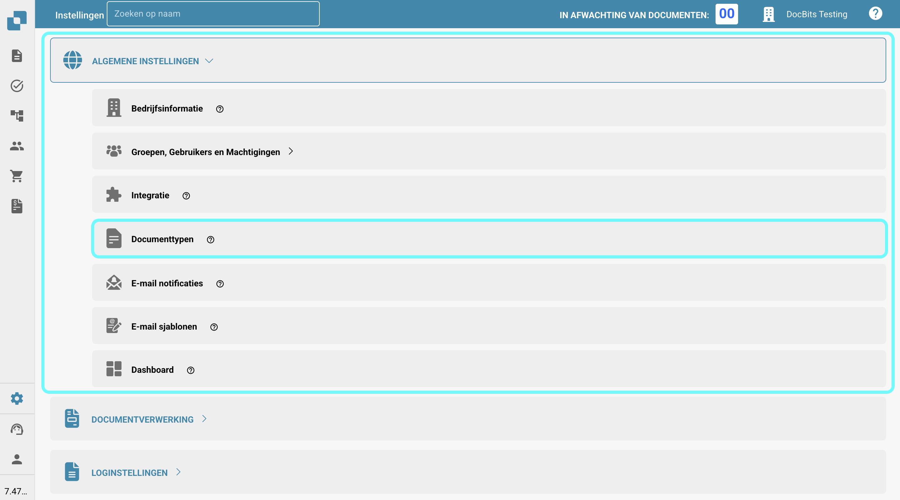
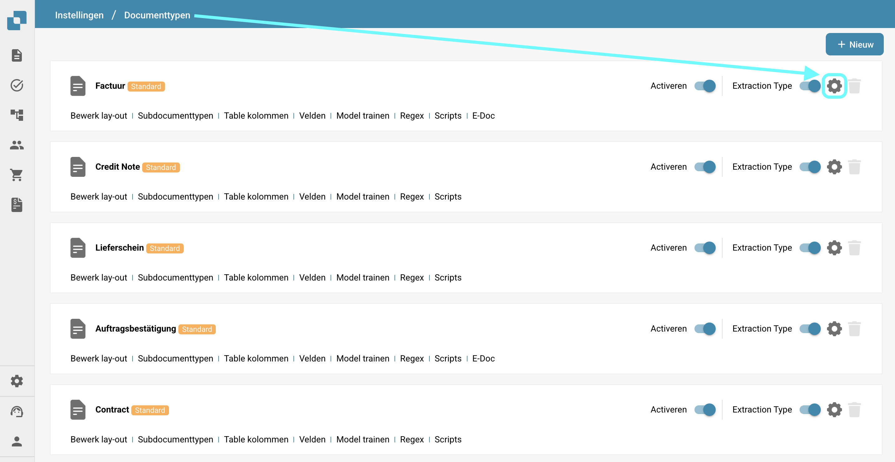
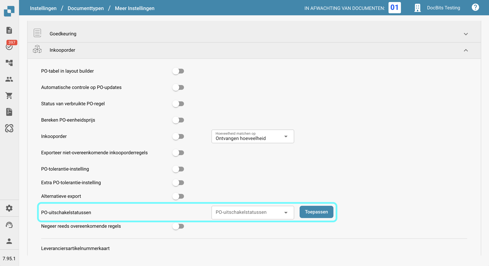
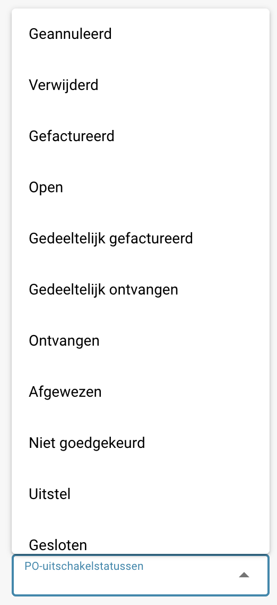
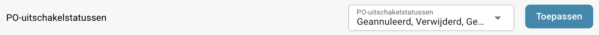

# PO-uitschakelstatussen

## **Overzicht**

De **PO-uitschakelstatussen** instelling stelt gebruikers in staat om inkooporder (PO) statussen op te geven die voorkomen dat facturen aan die PO's worden gekoppeld. Als een inkooporder een status heeft die in deze instelling is vermeld, kan deze **niet** worden gebruikt voor factuurmatching in het PO-matching scherm, waardoor verdere verwerking van gerelateerde facturen wordt stopgezet totdat de status van de PO verandert in een die niet is uitgeschakeld.\
\
Door deze instelling te gebruiken, kunnen gebruikers ervoor zorgen dat inkooporders met specifieke statussen geen verdere factuurverwerking ondergaan, wat fouten vermindert en onnodige betalingen voorkomt.

## **Activatiestappen**

1.  Ga naar **Instellingen → Globale instellingen → Documenttypen**

    <figure><figcaption></figcaption></figure>
2.  Selecteer het gewenste documenttype en klik op **Meer instellingen**.

    <figure><figcaption></figcaption></figure>
3.  Ga in de sectie **Inkooporder** naar de optie **PO-uitschakelstatussen**.

    <figure><figcaption></figcaption></figure>

### **Hoe een uitgeschakelde inkooporder te identificeren**

In het **PO-matching** scherm verschijnt een uitgeschakelde inkooporder **doorgehaald**. Dit geeft visueel aan dat de PO momenteel beperkt is in het matchen vanwege zijn status.

<figure><figcaption></figcaption></figure>

### **Hoe het in te stellen**

1. In de instelling **PO-uitschakelstatussen** zie je een selectievak aan de linkerkant.
2.  Door op dit vak te klikken, opent een dropdownlijst met beschikbare PO-statussen.

    <figure><figcaption></figcaption></figure>
3. Selecteer een of meer statussen door erop te klikken. Klik opnieuw om te deselecteren.
4.  Klik op de knop **Toepassen** om je wijzigingen op te slaan.

    <figure><figcaption></figcaption></figure>

**Beschikbare statussen**

* Geannuleerd
* Verwijderd
* Gefactureerd
* Open
* Gedeeltelijk gefactureerd
* Gedeeltelijk ontvangen
* Ontvangen
* Afgewezen
* Niet goedgekeurd
* Uitstel
* Gesloten
