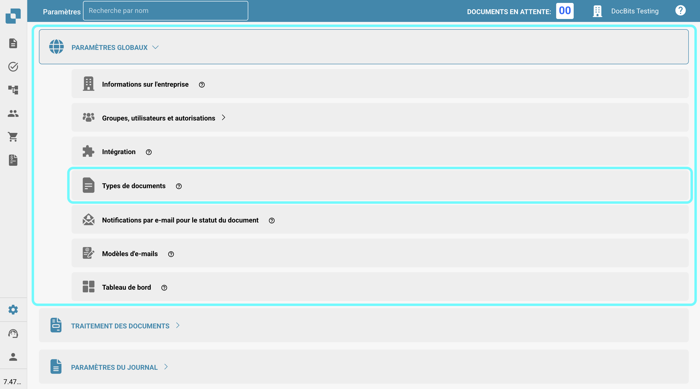

# Statuts de désactivation des bons de commande

## **Aperçu**

Le paramètre **PO Désactiver Statuts** permet aux utilisateurs de spécifier les statuts de bon de commande (PO) qui empêchent les factures d'être associées à ces POs. Si un bon de commande a un statut répertorié dans ce paramètre, il **ne peut pas** être utilisé pour l'appariement des factures dans l'écran d'appariement des PO, empêchant ainsi le traitement ultérieur des factures associées jusqu'à ce que le statut du PO change pour un statut qui n'est pas désactivé.\
\
En utilisant ce paramètre, les utilisateurs peuvent s'assurer que les bons de commande avec des statuts spécifiques ne subissent pas de traitement supplémentaire des factures, réduisant ainsi les erreurs et empêchant les paiements inutiles.

## **Étapes d'activation**

1.  Allez dans **Paramètres → Paramètres globaux → Types de documents**

    <figure><figcaption></figcaption></figure>
2.  Sélectionnez le type de document souhaité et cliquez sur **Plus de paramètres.**

    <figure><figcaption></figcaption></figure>
3.  Dans la section **Bon de commande**, accédez à l'option **PO Désactiver Statuts**.

    <figure><figcaption></figcaption></figure>

### **Comment identifier un bon de commande désactivé**

Dans l'écran **Appariement des PO**, un bon de commande désactivé apparaît **barré**. Cela indique visuellement que le PO est actuellement restreint d'être associé en raison de son statut.

<figure><figcaption></figcaption></figure>

### **Comment le configurer**

1. Dans le paramètre **PO Désactiver Statuts**, vous verrez un champ de sélection sur le côté gauche.
2.  En cliquant sur ce champ, une liste déroulante des statuts de PO disponibles s'ouvre.

    <figure><figcaption></figcaption></figure>
3. Sélectionnez un ou plusieurs statuts en cliquant dessus. Cliquez à nouveau pour désélectionner.
4.  Cliquez sur le bouton **Appliquer** pour enregistrer vos modifications.

    <figure><figcaption></figcaption></figure>

**Statuts disponibles**

* Canceled
* Deleted
* Invoiced
* Open
* Partially Invoiced
* Partially Received
* Received
* Rejeté
* Unapproved
* Hold
* Closed
