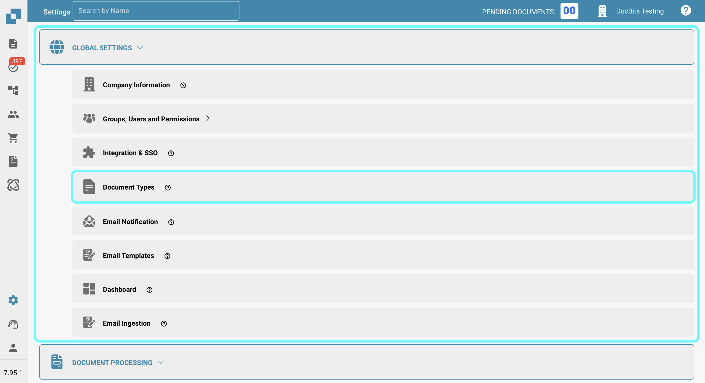

# Purchase order disable statuses

## **Overview**

The **PO Disable Statuses** setting allows users to specify purchase order (PO) statuses that prevent invoices from being matched to those POs. If a purchase order has a status listed in this setting, it **cannot** be used for invoice matching in the PO matching screen, stopping further processing of related invoices until the PO's status changes to one that is not disabled.\
\
By using this setting, users can ensure that purchase orders with specific statuses do not undergo further invoice processing, reducing errors and preventing unnecessary payments.

## **Activation Steps**&#x20;

1.  Go to **Settings → Global Settings → Document Types**

    <figure><figcaption></figcaption></figure>
2.  Select the desired document type and click on **More Settings**

    <figure><figcaption></figcaption></figure>
3.  In the **Purchase Order** section, navigate to the **PO Disable Statuses** option.

    <figure><figcaption></figcaption></figure>

\

### **How to Identify a Disabled Purchase Order**

In the **PO Matching** screen, a disabled purchase order appears **crossed out**. This visually indicates that the PO is currently restricted from being matched due to its status.

<figure><figcaption></figcaption></figure>

### **How to set it up**&#x20;

1. In the **PO Disable Statuses** setting, you will see a selection field on the left side.
2.  Clicking this field opens a dropdown list of available PO statuses.\

    
<figure><figcaption></figcaption></figure>

3. Select one or more statuses by clicking on them. Click again to deselect.
4.  Click the **Apply** button to save your changes.

    <figure><figcaption></figcaption></figure>

**Available Statuses**

* Canceled&#x20;
* Deleted
* Invoiced&#x20;
* Open
* Partially Invoiced&#x20;
* Partially Received&#x20;
* Received&#x20;
* Rejected
* Unapproved&#x20;
* Hold
* Closed

\
