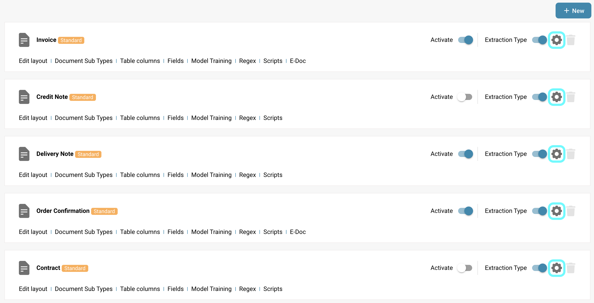
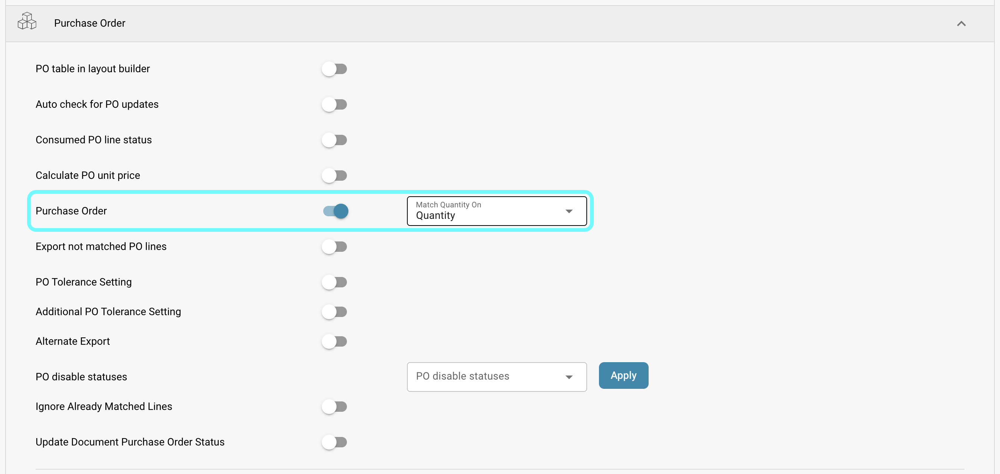

# Purchase Order

## Overview

This setting enables the [**Purchase Order Matching**](../../../../../../end-user-and-partner-section/end-user-section/purchase-order-matching/) section, which becomes accessible after document validation.

<mark style="color:red;">**Note**</mark>: For the **Invoice** document type, the following additional requirements must be met:

* The **Purchase Order** setting must be enabled (as described on this page)
* The invoice must be of type **Purchase Invoice**
* An **Extracted Table** must be present

## Activation Steps 

1. Go to **Settings** -> **Global Settings** -> **Document Types**
2.  Select the desired document type and click on **More Settings**.

    <figure><figcaption></figcaption></figure>
3.  In the **Purchase Order** section, navigate to the **Purchase Order** option.

    <figure><figcaption></figcaption></figure>

## **Functionality**

Once activated, the [**Purchase Order Matching**](../../../../../../end-user-and-partner-section/end-user-section/purchase-order-matching/) section becomes available after document validation.&#x20;

You can also configure which type of quantity from **Infor** should be used for matching by selecting one of the following options from the dropdown menu next to the setting:

* **Quantity**
* **Received Quantity**
* **Received Delivery Open Quantity**

