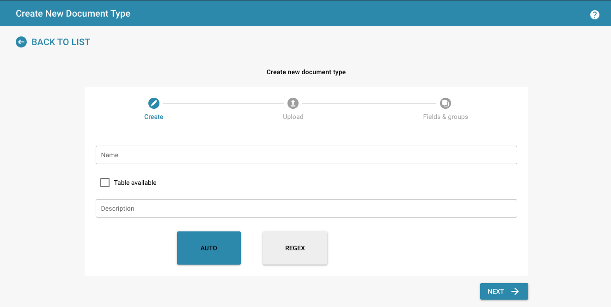
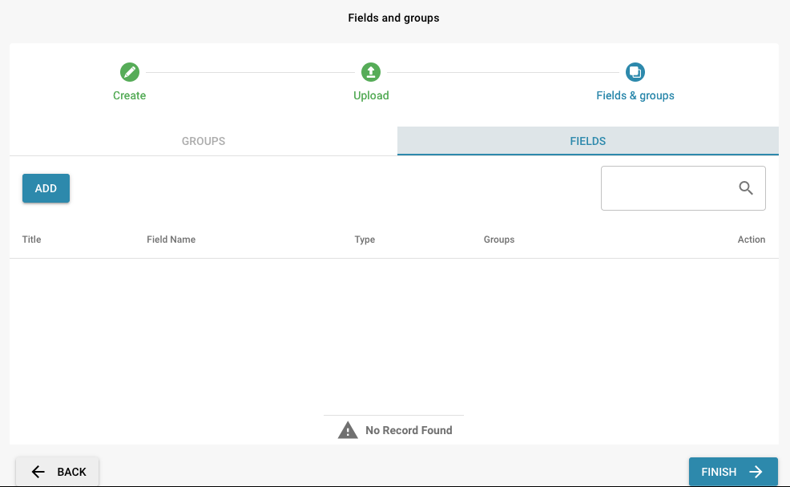
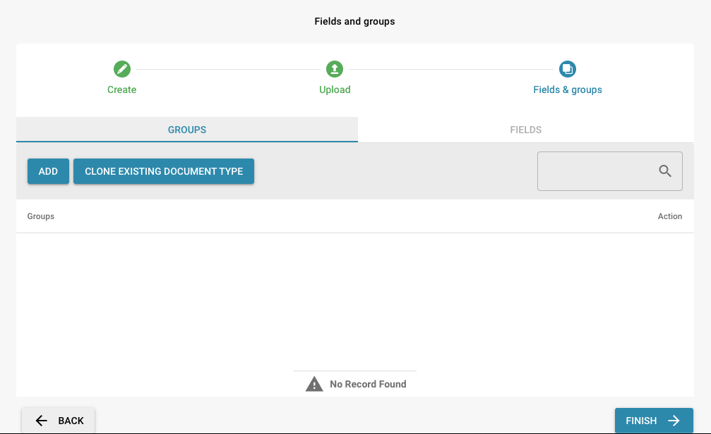

# Purpose and use

## Here are detailed explanations of the meaning and use of the listed settings in document processing to facilitate individual and controlled workflows:

### Skip Table Validation:

<figure><figcaption></figcaption></figure>

**Purpose:**

* This setting allows you to skip validation of tables.

**Use:**

* This is useful when using tables whose structure changes frequently or when validation causes unnecessary delays. Skipping validation can speed up processing, but this should only be used if data quality is otherwise assured.

### Duplicate Document Detection

<figure><figcaption></figcaption></figure>

**Purpose:**

* This setting enables the automatic detection of duplicate documents based on selected fields.

**Use:**

* This tool is designed to prevent the same documents being processed twice, ensuring efficiency in the processing workflow.

### Design in Review Form:

<figure><figcaption></figcaption></figure>

**Purpose:**

* This setting allows you to design documents directly in review mode.

**Use:**

* Useful for taking visual feedback and annotations into account during review and making design changes in real time. This improves the efficiency of the review process and allows designers and reviewers to work more closely together.

<figure><figcaption></figcaption></figure>

### Design Reject Form:

**Purpose:**

* This setting allows you to design the view of rejected documents directly.

**Use:**

* Useful for taking visual feedback and annotations into account while making design changes in real time. This improves the efficiency of the review process and allows designers and reviewers to work more closely together.

<figure><figcaption></figcaption></figure>

### Design Template:

<figure><figcaption></figcaption></figure>

**Purpose:**

* Templates for standardizing document layouts and formatting.

**Use:**

* Makes it easier to create consistent and professional documents. Companies can create their own design templates that follow brand guidelines and formatting standards, increasing efficiency and improving the appearance of the documents.

<figure><figcaption></figcaption></figure>

### Export to IDM (Information Document Management):

<figure><figcaption></figcaption></figure>

**Purpose:**

* This setting enables documents to be exported to an Information Document Management System (IDM).

**Use:**

* This function is used to export documents directly from the creation or review system to an IDM system to store, manage and facilitate access to them centrally. This improves the organization and traceability of documents, ensures that they are kept securely and makes it easier to comply with compliance regulations.

### Approval:

<figure><figcaption></figcaption></figure>

**Purpose:**

* Document approval workflow.

**Use:**

* Defines approval steps and responsibilities. This setting is critical for compliance with company policies and regulatory requirements. It ensures that all relevant parties have reviewed and approved the document before it is finalized. Once the document is finalized, it can be stamped with an approval stamp.

**Design Approval Form:**

<figure><figcaption></figcaption></figure>

**Design Approval Form v2:**

<figure><figcaption></figcaption></figure>

**Design Second Approval form:**

<figure><figcaption></figcaption></figure>

### Purchase Order / Auto Accounting:

**Purpose:**

* Automates the processing and posting of purchase orders.

**Usage:**

* Facilitates the automatic creation and processing of purchase orders and their posting in financial systems. This saves time, reduces errors and improves efficiency in the purchasing and accounting process.

### PO Table in Layout Builder:

<figure><figcaption></figcaption></figure>

**Purpose:**

* Enables the integration of purchase order tables into the layout of documents.

**Usage:**

* Designs purchase order tables directly in the Layout Builder and adapts them to specific requirements. This ensures a seamless and consistent design of documents containing purchase order information.

### Purchase Order&#x20;

<figure><figcaption></figcaption></figure>

**Purpose:**

* Enables automatic matching in PO Matching&#x20;

**Usage:**

* The quantity is automatically matched to one of the following in the PO matching: Received Quantity, Open Quantity or Received Delivery Quantity.

### Export not matched PO lines:

<figure><figcaption></figcaption></figure>

**Purpose:**

* Exports purchase order lines that do not match the existing purchase orders.

**Usage:**

* Identifies and exports lines that may contain errors or require special review. This helps to detect and correct discrepancies before the orders are completed.

### PO Tolerance Settings:

<figure><figcaption></figcaption></figure>

**Purpose:**

* Defines tolerance limits for deviations in purchase orders.

**Usage:**

* Determines how much deviation from the order is acceptable without requiring additional approval.&#x20;
* This include price or quantity deviations. This setting helps streamline the approval process and avoid unnecessary delays.

<figure><figcaption></figcaption></figure>

### Additional PO Tolerance Settings:

<figure><figcaption></figcaption></figure>

**Purpose:**

* These settings provide advanced configuration options for purchase orders (POs) to meet specific business requirements.

**Usage:**

* You can set additional parameters and conditions for purchase orders, such as delivery terms, specific payment terms. This facilitates precise control and customization of the purchase order processes, thereby improving efficiency and accuracy in purchasing.

<figure><figcaption></figcaption></figure>

### Document Alternative Export:

<figure><figcaption></figcaption></figure>

**Purpose:**

* This setting allows documents to be exported in different formats or via alternative methods.

**Usage:**

* You can specify in which formats (e.g. PDF, DOCX, XML) or via which channels (e.g. email, cloud storage) documents should be exported. This increases flexibility and allows documents to be exported according to the requirements of different recipients or systems.

<figure><figcaption></figcaption></figure>

### PO Disable Statuses:

<figure><figcaption></figcaption></figure>

**Purpose:**

* This setting allows certain statuses of purchase orders to be disabled or locked in order to control the workflow.

**Usage:**

* Companies can specify which statuses should be disabled in certain situations to prevent orders from being edited or modified incorrectly. This is useful to ensure the integrity and consistency of the purchase order process.
* For example, an order that has already been approved and released for delivery could no longer be processed or cancelled.

<figure><figcaption></figcaption></figure>

### Importance for controlled workflows

**Additional PO Settings:**

**Individual customization:**&#x20;

* Allows the adjustment of the order settings to specific business requirements, which increases efficiency and accuracy in purchasing.

**Controlled processes:**&#x20;

* Supports the implementation of detailed purchasing rules and procedures.

**Additional PO Tolerance Settings:**

**Efficient approval processes:**&#x20;

* Minimizes unnecessary approval steps by setting clear tolerance limits.

**Risk management:**&#x20;

* Helps to identify significant deviations at an early stage and take appropriate action.

**Document Alternative Export:**

**Flexibility:**&#x20;

* Allows the export of documents in different formats that meet the requirements of different systems and recipients.

**Efficiency:**&#x20;

* Automates the export process, reducing manual work and errors.

**PO Disable Statuses:**

**Process control:**&#x20;

* Prevents unwanted changes or edits to orders that are already in an advanced status.

**Security:**&#x20;

* Protects the integrity of the ordering process and ensures that only authorized changes are made.


