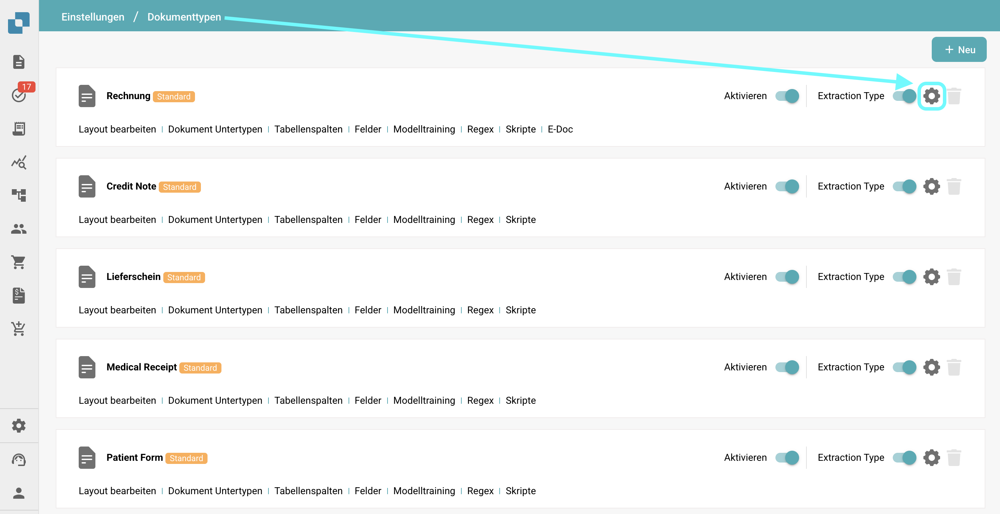
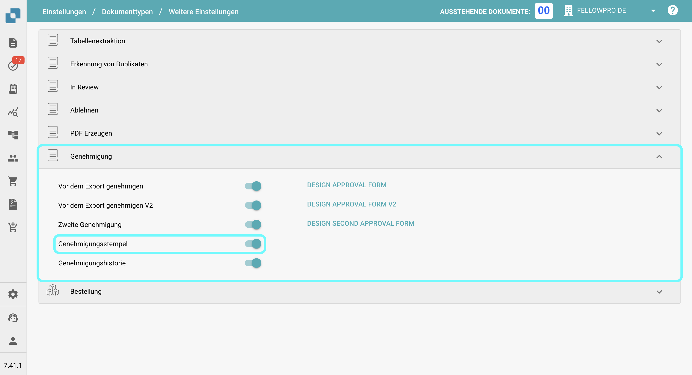
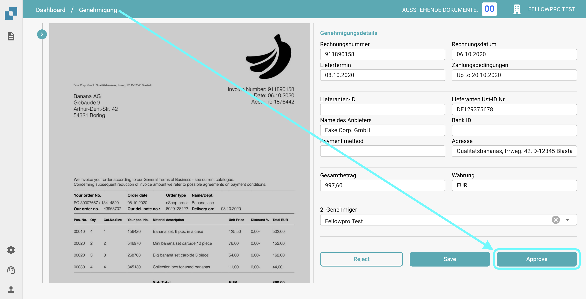
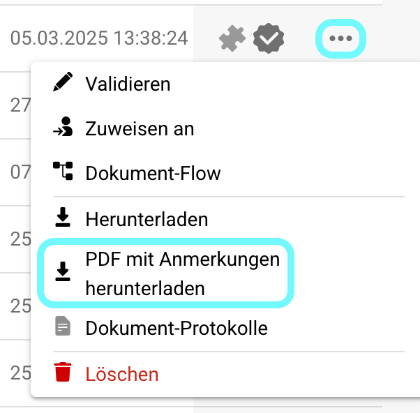

# Genehmigungsstempel

## **Übersicht:**

Dieses Feature fügt automatisch einen Genehmigungsstempel zu einem Dokument hinzu, wenn es im Genehmigungsbildschirm genehmigt wird. Wenn ein Dokument einen Genehmigungsstempel enthält, wird es beim **Exportieren nach IDM** einbezogen.

## Aktivieren der Genehmigungsstempel-Funktion

Um die Genehmigungsstempel-Funktion zu aktivieren, folgen Sie diesen Schritten:

1.  Gehen Sie zu **Einstellungen** → **Globale Einstellungen** → **Dokumenttypen**.

    <figure><figcaption></figcaption></figure>
2.  **Wählen Sie den Dokumenttyp** aus, für den Sie die Stempelgenehmigung aktivieren möchten, und klicken Sie auf **Weitere Einstellungen**.

    <figure><figcaption></figcaption></figure>
3.  Aktivieren Sie im Abschnitt **Genehmigung** die Option **Genehmigungsstempel**.

    <figure><figcaption></figcaption></figure>

## Nach der Aktivierung:

Sobald die Funktion aktiviert ist, erhält jedes Dokument im Status "ausstehende Genehmigung" automatisch einen Genehmigungsstempel, sobald es genehmigt wird. Der Stempel enthält das "Approved"-Logo, den Namen des Benutzers, der das Dokument genehmigt hat, und die Uhrzeit, zu der das Dokument genehmigt wurde.

<figure><figcaption></figcaption></figure>

<figure><figcaption></figcaption></figure>

### Herunterladen von PDFs mit oder ohne den **Genehmigungsstempel** 

* Wenn ein Dokument einen Genehmigungsstempel hat, können Sie wählen, ob Sie die PDF entweder mit oder ohne den Genehmigungsstempel herunterladen möchten.
* Gehen Sie dazu zum **Dashboard**.
* Klicken Sie auf die **drei Punkte** in der **Aktionen**-Spalte.
* Wählen Sie eine der beiden verfügbaren Download-Optionen:
  * **Herunterladen mit Anmerkungen**
  * **Herunterladen ohne Anmerkungen**

<figure><figcaption></figcaption></figure>
