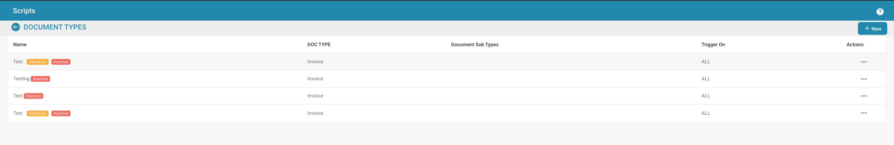
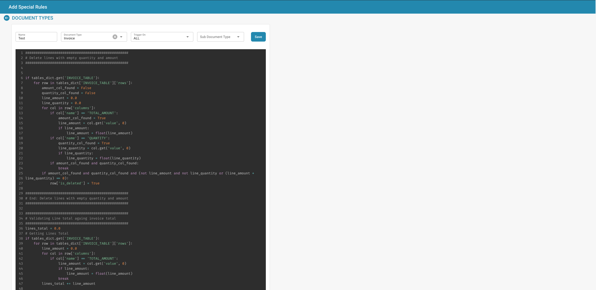

# Script

<figure><figcaption></figcaption></figure>

## **Overzicht**

Scripts in Docbits zijn doorgaans geschreven in een scripttaal die door het systeem Python wordt ondersteund. Ze worden geactiveerd tijdens de documentverwerkingsworkflow om complexe bedrijfslogica toe te passen of om de integriteit en nauwkeurigheid van gegevens te waarborgen voordat de gegevens verder worden verwerkt of opgeslagen.

## **Belangrijkste Kenmerken en Opties**

1. **Scriptbeheer**:
   * **Naam**: Elk script krijgt een unieke naam ter identificatie.
   * **Documenttype**: Koppelt het script aan een specifiek documenttype, wat bepaalt op welke documenten het script zal worden toegepast.
   * **Trigger Op**: Definieert wanneer het script wordt geactiveerd (bijv. bij documentupload, vóór gegevensexport, na gegevensvalidatie).
   * **Actieve/Inactieve Status**: Hiermee kunnen beheerders scripts activeren of deactiveren zonder ze te verwijderen, wat flexibiliteit biedt bij testen en implementatie.
2. **Scripteditor**:
   * Biedt een interface waar scripts kunnen worden geschreven en bewerkt. De editor ondersteunt doorgaans syntaxisaccentuering, foutaccentuering en andere functies om te helpen bij de ontwikkeling van scripts.
   * **Voorbeeldscript**: Scripts kunnen bewerkingen bevatten zoals het doorlopen van factuurregels om totalen te valideren of om invoer te verwijderen die niet aan bepaalde criteria voldoet.

<figure><figcaption></figcaption></figure>
