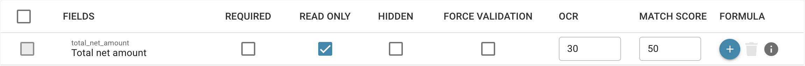

# Erstellen und Bearbeiten von Skripten

## Um ein neues Skript in DocBits zu erstellen, folgen Sie dieser detaillierten Anleitung:

**Wählen Sie die Skriptsprache:**

Zuerst müssen Sie die Skriptsprache auswählen, die Sie verwenden möchten. DocBits unterstützt normalerweise gängige Skriptsprachen wie Python, JavaScript oder SQL. Die Wahl der Sprache hängt von den Anforderungen Ihres Projekts und Ihren eigenen Kompetenzen ab.

**Öffnen Sie die Skriptentwicklungsumgebung:**

Melden Sie sich bei DocBits an und navigieren Sie zur Skriptentwicklungsumgebung. Diese befindet sich im Administrationsbereich.

<figure><figcaption></figcaption></figure>

**Erstellen Sie ein neues Skript:**

Klicken Sie auf die Schaltfläche "+ Neu", um einen neuen Skripteditor zu öffnen.

<figure><figcaption></figcaption></figure>

**Skriptcode schreiben:**

Verwenden Sie den Editor, um den Code für Ihr Skript zu schreiben. Beginnen Sie mit der Basissyntax der gewählten Skriptsprache.

Wenn Sie beispielsweise Python verwenden, könnte Ihr Skript so aussehen:

## 1. Beispielskript in Python

<figure><figcaption></figcaption></figure>

## Funktion zum Bereinigen von Patientennamen

def clean_patient_name(name): cleaned_name = name.strip().title() # Leerzeichen entfernen und Großschreibung anwenden

return cleaned_name

## Hauptprogramm

if __name__ == "__main__": patient_name = " john doe " cleaned_name = clean_patient_name(patient_name) print("Bereinigter Patientenname:", cleaned_name)

## 2. Beispielskript

<figure><figcaption></figcaption></figure>

**Testen Sie das Skript:**

Überprüfen Sie den Code auf Fehler und testen Sie ihn in einer Testumgebung. Stellen Sie sicher, dass das Skript die erwarteten Ergebnisse liefert und korrekt funktioniert.

<figure><figcaption></figcaption></figure>

**Speichern Sie das Skript:**

Speichern Sie das Skript in DocBits und geben Sie ihm einen aussagekräftigen Namen, der den Zweck des Skripts beschreibt.

<figure><figcaption></figcaption></figure>

**Zuordnung des Skripts zu Belegtypen:**

Ein wichtiger Schritt ist die Zuordnung des Skripts zu den entsprechenden Belegtypen. Dies bestimmt, wann und wie das Skript angewendet wird. Dies kann normalerweise über eine Konfigurationsoberfläche in DocBits erfolgen, wo Sie das Skript einem bestimmten Belegtyp zuweisen und festlegen können, unter welchen Bedingungen es angewendet werden soll.

<figure><figcaption></figcaption></figure>

**Überprüfung und Veröffentlichung:**

Nachdem Sie das Skript erstellt, getestet und zugeordnet haben, überprüfen Sie es erneut auf Fehler und Inkonsistenzen. Wenn alles in Ordnung ist, können Sie das Skript in der DocBits-Produktionsumgebung veröffentlichen.

<figure><figcaption></figcaption></figure>

<figure><figcaption></figcaption></figure>

Durch diese Schritte können Sie erfolgreich ein neues Skript in DocBits erstellen, testen und implementieren, um Prozesse zu automatisieren und die Effizienz der Dokumentation zu verbessern.
