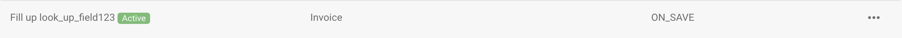

# Creating and Editing Scripts

## To create a new script in DocBits, follow these detailed instructions:

**Choose the scripting language:**

First, you need to choose the scripting language you want to use. DocBits typically supports common scripting languages ​​such as Python, JavaScript, or SQL. The choice of language depends on the needs of your project and your own competency.

**Open the script development environment:**

Log in to DocBits and navigate to the script development environment. This is in the administration area.

<figure><figcaption></figcaption></figure>

**Create a new script:**

Click the "+ New" button to open a new script editor.

<figure><figcaption></figcaption></figure>

**Write the code:**

Use the editor to write the code for your script. Start with the basic syntax of your chosen scripting language.

For example, if you are using Python, your script might look like this:

## 1. Example script in Python

<figure><figcaption></figcaption></figure>

## Function to clean patient names

def clean\_patient\_name(name): cleaned\_name = name.strip().title() # Remove spaces and apply capitalization

return cleaned\_name

## Main program

if **name** == "**main**": patient\_name = " john doe " cleaned\_name = clean\_patient\_name(patient\_name) print("Cleaned patient name:", cleaned\_name)

## 2. Example script

<figure><figcaption></figcaption></figure>

**Test the script:**

Check the code for errors and test it in a test environment. Make sure the script produces the expected results and works correctly.

<figure><figcaption></figcaption></figure>

**Save the script:**

Save the script in DocBits and give it a meaningful name that describes the purpose of the script.

<figure><figcaption></figcaption></figure>

**Mapping the script to document types:**

An important step is mapping the script to the appropriate document types. This determines when and how the script is applied. This can usually be done through a configuration interface in DocBits, where you can assign the script to a specific document type and specify under which conditions it should be applied.

<figure><figcaption></figcaption></figure>

**Review and publish:**

After you have created, tested and mapped the script, check it again for errors and inconsistencies. If everything is OK, you can publish the script to the DocBits production environment.

<figure><figcaption></figcaption></figure>

<figure><figcaption></figcaption></figure>

Through these steps, you can successfully create, test and implement a new script in DocBits to automate processes and improve the efficiency of medical documentation.