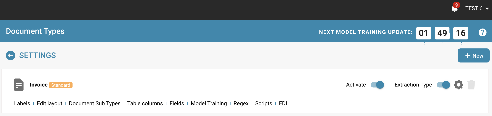
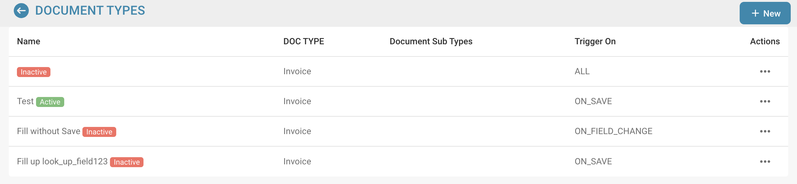
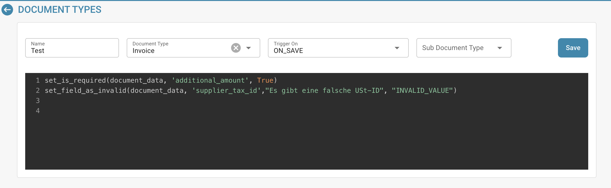

# Script Activation and Management

## Here is a guide on how to enable, disable and manage existing scripts in DocBits to suit your current processing needs:

**Logging into DocBits:**

* Open your web browser and log into DocBits with your credentials.

<figure><figcaption></figcaption></figure>

**Navigate to Script Management:**

* Look for the option to manage scripts in the DocBits interface.
* This may vary depending on your setup and configuration of DocBits.

<figure><figcaption></figcaption></figure>

**Viewing existing scripts:**

* Once you are in the script management interface, you will see a list of all existing scripts.
* Here you can scroll through the list to find the desired script you want to enable, disable or edit.

<figure><figcaption></figcaption></figure>

**Enabling or disabling a script:**

* To enable or disable a script, find the relevant script in the list and enable or disable the script.
* Make sure to save changes after making your selections.

<figure><figcaption></figcaption></figure>

**Editing a script:**

* If you need to edit an existing script, look for the button in the script management interface that allows editing the script.

<figure><figcaption></figcaption></figure>

* Click it to open the editor where you can modify the script's code.
* After making your changes, save the script again.

<figure><figcaption></figcaption></figure>

**Review and test:**

* Before making changes to a script, carefully review the existing code and consider what impact your changes might have.
* Test the script in a test environment to make sure it works as expected.

<figure><figcaption></figcaption></figure>

**Documentation:**

* Don't forget to document your changes.
* Write down what changes you made and why so that other users on the team can understand how the script works and what impact your changes might have.

**Publishing changes:**

* When you are satisfied with your changes, republish the script to the DocBits production environment for the updated version to take effect.

These steps allow you to enable, disable and manage existing scripts in DocBits to adapt them to current processing needs and ensure that your documentation processes run efficiently and correctly.
