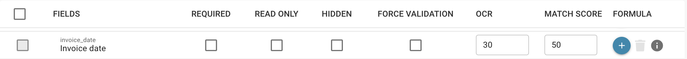

# Skriptaktivierung und -verwaltung

## Hier ist eine Anleitung, wie Sie bestehende Skripte in DocBits aktivieren, deaktivieren und verwalten können, um sie an Ihre aktuellen Verarbeitungsanforderungen anzupassen:

**Anmelden bei DocBits:**

* Öffnen Sie Ihren Webbrowser und melden Sie sich mit Ihren Zugangsdaten bei DocBits an.

<figure><figcaption></figcaption></figure>

**Navigieren zur Skriptverwaltung:**

* Suchen Sie in der DocBits-Oberfläche nach der Option zur Verwaltung von Skripten.
* Dies kann je nach Setup und Konfiguration von DocBits variieren.

<figure><figcaption></figcaption></figure>

**Anzeigen vorhandener Skripte:**

* Sobald Sie sich in der Skriptverwaltungsoberfläche befinden, sehen Sie eine Liste aller vorhandenen Skripte.
* Hier können Sie durch die Liste scrollen, um das gewünschte Skript zu finden, das Sie aktivieren, deaktivieren oder bearbeiten möchten.

<figure><figcaption></figcaption></figure>

**Aktivieren oder Deaktivieren eines Skripts:**

* Um ein Skript zu aktivieren oder zu deaktivieren, suchen Sie das entsprechende Skript in der Liste und betätigen Sie den entsprechenden Schalter.
* Stellen Sie sicher, dass Sie die Änderungen nach Ihrer Auswahl speichern.

<figure><figcaption></figcaption></figure>

**Bearbeiten eines Skripts:**

* Wenn Sie ein bestehendes Skript bearbeiten müssen, suchen Sie in der Skriptverwaltungsoberfläche nach der Schaltfläche zum Bearbeiten des Skripts.

<figure><figcaption></figcaption></figure>

* Klicken Sie darauf, um den Editor zu öffnen, in dem Sie den Code des Skripts ändern können.
* Nachdem Sie Ihre Änderungen vorgenommen haben, speichern Sie das Skript erneut.

<figure><figcaption></figcaption></figure>

**Überprüfung und Test:**

* Bevor Sie Änderungen an einem Skript vornehmen, überprüfen Sie sorgfältig den vorhandenen Code und überlegen Sie, welche Auswirkungen Ihre Änderungen haben könnten.
* Testen Sie das Skript in einer Testumgebung, um sicherzustellen, dass es wie erwartet funktioniert.

<figure><figcaption></figcaption></figure>

**Dokumentation:**

* Vergessen Sie nicht, Ihre Änderungen zu dokumentieren.
* Notieren Sie, welche Änderungen Sie vorgenommen haben und warum, damit andere Benutzer im Team verstehen können, wie das Skript funktioniert und welche Auswirkungen Ihre Änderungen haben könnten.

**Veröffentlichen von Änderungen:**

* Wenn Sie mit Ihren Änderungen zufrieden sind, veröffentlichen Sie das Skript erneut in der DocBits-Produktionsumgebung, damit die aktualisierte Version in Kraft tritt.

Diese Schritte ermöglichen es Ihnen, bestehende Skripte in DocBits zu aktivieren, zu deaktivieren und zu verwalten, um sie an die aktuellen Verarbeitungsanforderungen anzupassen und sicherzustellen, dass Ihre Dokumentationsprozesse effizient und korrekt ablaufen.
