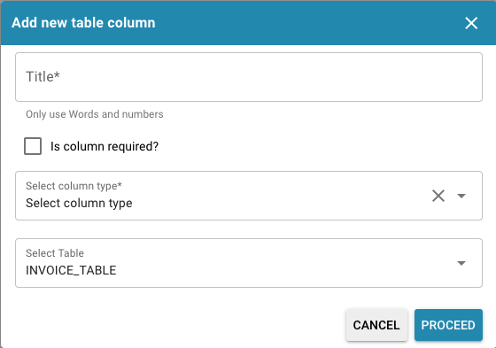

# Colunas da Tabela

<figure><figcaption></figcaption></figure>

#### Visão Geral

A interface Colunas da Tabela no Docbits é usada para especificar as colunas que aparecem em tabelas de dados para cada tipo de documento. Cada coluna pode ser configurada para armazenar tipos específicos de dados, como strings ou valores numéricos, e pode ser essencial para funções de classificação, filtragem e relatórios dentro do Docbits.

#### Principais Recursos e Opções

1. **Configuração da Coluna**:
* **Nome da Coluna**: O identificador da coluna no banco de dados.
* **Título**: O título legível por humanos da coluna que aparecerá na interface.
* **Tipo de Coluna**: Define o tipo de dados da coluna (por exemplo, STRING, VALOR), o que determina que tipo de dados pode ser armazenado na coluna.
* **Nome da Tabela**: Indica a qual tabela a coluna pertence, vinculando-a a um tipo de documento específico como INVOICE\_TABLE.
2. **Ações**:
* **Editar**: Modificar as configurações de uma coluna existente.
* **Excluir**: Remover a coluna da tabela, o que é útil se os dados não forem mais necessários ou se a estrutura de dados do tipo de documento mudar.
3. **Adicionando Novas Colunas e Tabelas**:
* **Adicionar Nova Coluna de Tabela**: Abre um diálogo onde você pode definir uma nova coluna, incluindo seu nome, se é obrigatório, seu tipo de dados e a tabela à qual pertence.
* **Criar Nova Tabela**: Permite a criação de uma nova tabela, definindo um nome único que será usado para armazenar dados relacionados a um conjunto específico de tipos de documento.

<figure><figcaption></figcaption></figure>

<figure><figcaption></figcaption></figure>

Esta seção é vital para manter a integridade estrutural e usabilidade dos dados dentro do sistema Docbits, garantindo que os dados extraídos de documentos sejam armazenados de forma organizada e acessível.


