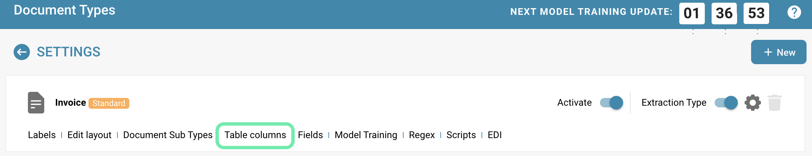

# Hinzufügen einer neuen Spalte

## Das Hinzufügen einer neuen Spalte zu einer bestehenden Tabelle erfordert eine sorgfältige Planung und Ausführung, um sicherzustellen, dass die Datenintegrität gewahrt bleibt und die Anforderungen der Anwendung erfüllt werden.

<figure><figcaption>
Einstellungen: Belegtypen
</figcaption></figure>

<figure><figcaption>
Tabellenspalten
</figcaption></figure>

**Hier sind die detaillierten Schritte zum Hinzufügen einer neuen Spalte:**

<figure><figcaption></figcaption></figure>

**Anforderungsanalyse:**

* Überprüfen Sie die Anforderungen Ihrer Anwendung und identifizieren Sie den Zweck der neuen Spalte. Welche Art von Daten wird gespeichert? Wie wird diese Spalte in der Anwendung verwendet?

<figure><figcaption>
Neue Tabellenspalte hinzufügen
</figcaption></figure>

**Wahl des richtigen Spaltentyps:**

* Wählen Sie den am besten geeigneten Spaltentyp basierend auf den Daten, die in der Spalte gespeichert werden sollen. Dies kann AMOUNT für Beträge, STRING für Zeichenfolgen, DATE für Daten usw. sein.
* Die Wahl des richtigen Spaltentyps ist wichtig, um die Datenintegrität sicherzustellen und den Speicherplatz effizient zu nutzen.

<figure><figcaption></figcaption></figure>

**Wahl der richtigen Tabelle:**

* Um den korrekten Spaltentyp in einer bestimmten Tabelle, wie z. B. der Rechnungstabelle, auszuwählen, ist es wichtig, die spezifischen Anforderungen der in dieser Tabelle zu speichernden Daten zu berücksichtigen.

<figure><figcaption></figcaption></figure>

**Entscheidung über die Notwendigkeit der Spalte:**

* Überlegen Sie, ob die neue Spalte erforderlich ist oder ob sie NULL-Werte zulassen soll. Wenn die Spalte obligatorisch ist, sollte sie als NOT NULL markiert werden, um sicherzustellen, dass wichtige Daten nicht fehlen.
* Überlegen Sie auch, ob die Spalte in Zukunft zu einem Pflichtfeld für Ihre Anwendung werden könnte.

**Datenbanksicherung:**

* Bevor Sie die neue Spalte hinzufügen, erstellen Sie eine Sicherungskopie Ihrer Datenbank, um sicherzustellen, dass Sie im Falle von Problemen auf eine funktionierende Version zurückgreifen können.

**Ausführen der SQL-Anweisung:**

*   Verwenden Sie die SQL-Anweisung ALTER TABLE, um die neue Spalte hinzuzufügen. Die genaue Syntax hängt von der verwendeten Datenbankplattform ab, aber im Allgemeinen sieht die SQL-Anweisung so aus:

    <figure><figcaption></figcaption></figure>

    Ersetzen Sie table_name durch den Namen Ihrer Tabelle, new_column_name durch den Namen der neuen Spalte und data_type durch den von Ihnen gewählten Spaltentyp. Das Schlüsselwort [NOT NULL] gibt an, ob die Spalte obligatorisch ist.

**Testen und Validieren:**

* Nachdem die neue Spalte hinzugefügt wurde, überprüfen Sie gründlich, ob Ihre Anwendung ordnungsgemäß funktioniert. Führen Sie Tests durch, um sicherzustellen, dass Daten korrekt gespeichert und abgerufen werden und dass die neue Spalte wie erwartet funktioniert.

Durch sorgfältiges Befolgen dieser Schritte können Sie erfolgreich und effektiv eine neue Spalte zu Ihrer Datenbanktabelle hinzufügen, den richtigen Spaltentyp wählen und sicherstellen, dass die Spalte erforderlich ist, wenn sie benötigt wird.
