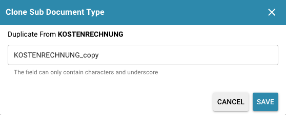
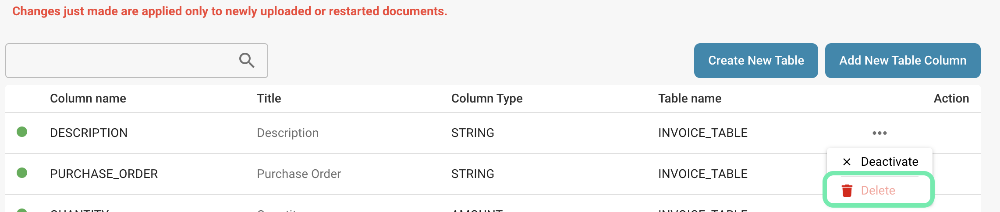

# Bearbeiten und Löschen von Spalten

Das Bearbeiten und Löschen von Spalten in einer Datenbanktabelle sind wichtige Operationen, die sorgfältig durchgeführt werden müssen, um die Datenintegrität zu gewährleisten und potenzielle Auswirkungen auf die Anwendungslogik und die Berichterstattung zu berücksichtigen.

<figure><figcaption></figcaption></figure>

**Hier sind die detaillierten Schritte für beide Aktionen:**

## Bearbeiten einer Spalte:

<figure><figcaption></figcaption></figure>

**Titel ändern:**

* Klicken Sie auf den Titel der Spalte, die Sie ändern möchten. Es öffnet sich ein Fenster, in dem Sie den Titel der Spalte ändern können.

**Anforderungsanalyse:**

* Identifizieren Sie den Grund für die Bearbeitung der Spalte. Möglicherweise müssen Sie den Datentyp ändern, Einschränkungen hinzufügen oder entfernen oder den Spaltennamen ändern.

**Überprüfung der Auswirkungen:**

* Bevor Sie Änderungen vornehmen, prüfen Sie, wie sich diese auf bestehende Daten und die Anwendungslogik auswirken. Beispielsweise können Änderungen am Datentyp dazu führen, dass Daten konvertiert werden oder verloren gehen.

**Datenbanksicherung:**

* Sichern Sie Ihre Datenbank, um sicherzustellen, dass Sie über eine funktionierende Version verfügen, auf die Sie im Falle von Problemen zurückgreifen können.

**Ausführen der SQL-Anweisung:**

* Verwenden Sie die SQL-Anweisung ALTER TABLE, um die gewünschten Änderungen an der Spalte vorzunehmen. Die genaue Syntax hängt von der verwendeten Datenbankplattform und den gewünschten Änderungen ab.

**Datenmigration:**

* Wenn Sie den Datentyp einer Spalte ändern, müssen Sie möglicherweise eine Datenmigration durchführen, um vorhandene Daten in das neue Format zu konvertieren.

**Testen und Validieren:**

* Überprüfen Sie nach der Bearbeitung der Spalte gründlich, ob Ihre Anwendung ordnungsgemäß funktioniert und ob die Daten korrekt gespeichert und abgerufen werden.

## Löschen einer Spalte:

<figure><figcaption></figcaption></figure>

**Anforderungsanalyse:**

* Stellen Sie sicher, dass Sie die Gründe für das Löschen der Spalte verstehen. Ist die Spalte nicht mehr relevant oder gibt es andere Möglichkeiten, sie zu konsolidieren?

**Überprüfung der Auswirkungen:**

* Analysieren Sie, wie sich das Löschen der Spalte auf bestehende Daten, die Anwendungslogik und die Berichterstattung auswirkt. Dies kann zu Datenverlust führen oder Abfragen und Berichte beeinträchtigen.

**Datenbanksicherung:**

* Erstellen Sie eine vollständige Sicherung Ihrer Datenbank, um sicherzustellen, dass Sie diese im Falle unerwarteter Probleme wiederherstellen können.

**Ausführen der SQL-Anweisung:**

* Verwenden Sie die SQL-Anweisung ALTER TABLE, um die Spalte zu entfernen. Die genaue Syntax variiert je nach Datenbankplattform.

**Datenmigration (falls erforderlich):**

* Wenn Sie wichtige Daten in der zu löschenden Spalte haben, müssen Sie möglicherweise eine Datenmigration durchführen, um diese Daten an einen anderen Ort zu verschieben oder sie zu löschen.

**Anpassung der Anwendungslogik:**

* Stellen Sie sicher, dass Ihre Anwendungslogik entsprechend angepasst wird, um sicherzustellen, dass sie nicht mehr auf die gelöschte Spalte zugreift.

**Testen und Validieren:**

* Überprüfen Sie gründlich, ob Ihre Anwendung korrekt funktioniert und ob alle Daten- und Berichtsfunktionen wie erwartet arbeiten.

Beim Bearbeiten oder Löschen von Spalten ist es entscheidend, dass Sie die Auswirkungen dieser Aktionen vollständig verstehen und angemessene Vorsichtsmaßnahmen treffen, um die Integrität Ihrer Datenbank zu wahren und sicherzustellen, dass Ihre Anwendung reibungslos läuft.
