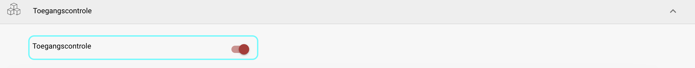
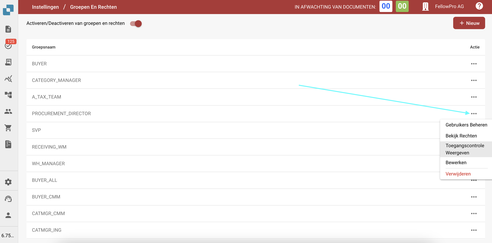
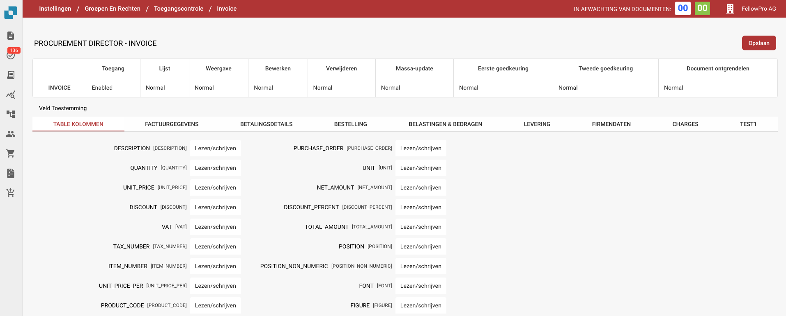

# Toegangscontrole

## Overzicht

Deze gids legt uit hoe beheerders toegangscontrole-instellingen kunnen definiëren voor verschillende gebruikersgroepen in DocBits. Elke groep kan worden geconfigureerd met aangepaste machtigingen op document- en veldniveau.

## Toegangscontrolegroepen

Het toegangscontrolepaneel stelt de beheerder in staat om gebruikersgroepen en hun respectieve machtigingen te beheren. Elke groep kan specifieke configuraties hebben met betrekking tot:

* **Documenttoegang**: Of de groep toegang heeft tot een documenttype.
* **Veldniveau-machtigingen**: Of de groep bepaalde velden binnen een document kan lezen, schrijven of bekijken.
* **Actiemachtigingen**: Welke acties de groep kan uitvoeren, zoals bewerken, verwijderen, massaal bijwerken en goedkeuren van documenten.

## Activatie

1. Navigeer naar **Instellingen**.
2. Selecteer **Documentverwerking**.
3. Selecteer **Module.**
4. Activeer **Toegangscontrole** door de schuifregelaar in te schakelen.

<figure><figcaption></figcaption></figure>

## **Groepsinstellingen openen**

1. Navigeer naar **Instellingen**.
2. Navigeer **Algemene Instellingen**.
3. Selecteer **Groepen, Gebruikers en Machtigingen**.
4. Selecteer **Groepen en rechten**.
5. Om machtigingen voor een groep, zoals PROCUREMENT\_DIRECTOR, te beheren, klik op de drie stippen aan de rechterkant van het scherm.
6. Selecteer **Toegangscontrole Weergeven**.

<figure><figcaption></figcaption></figure>

## Machtigingen voor groepen configureren

1.  **Overzicht van Toegangscontrole**:

    * In deze sectie kunt u de toegang voor alle documenttypes inschakelen of uitschakelen, zoals **Invoice**, **Credit Note**, **Purchase Order**, en meer.
    * U kunt toegangslevels definiëren zoals:
      * **Toegang**: Geeft toegang tot het documenttype.
      * **Lijst**: Bepaalt of het documenttype zichtbaar is in de lijstweergave.
      * **Weergave**: Specificeert de standaardweergave voor het document.
      * **Bewerken**: Geeft toestemming om het document te bewerken.
      * **Verwijderen**: Staat de groep toe documenten te verwijderen.
      * **Massa-update**: Maakt massa-update van het documenttype mogelijk.
      * **Goedkeuringsniveaus**: Stelt het vermogen van de groep in om documenten goed te keuren (Eerste en Tweede goedkeuring).
      * **Document ontgrendelen**: Bepaalt of de groep een document kan ontgrendelen voor verdere bewerkingen.
    * **Machtigingsniveaus:**
      * **Normal**: Alle gebruikers kunnen deze actie uitvoeren.
      * **Owner**: Alleen de toegewezen gebruiker heeft toestemming om deze actie uit te voeren.
      * **Admin**: Alleen gebruikers met administratieve bevoegdheden kunnen deze actie uitvoeren.

    Voorbeeldinstellingen voor **PROCUREMENT\_DIRECTOR**:

    * **Invoice**: Ingeschakeld voor alle machtigingen, inclusief bewerken en verwijderen.
    * **Purchase Order**: Ingeschakeld met normale machtigingen voor alle acties.
2. **Veldniveau-machtigingen**:
   * Binnen elk documenttype kunnen specifieke velden worden geconfigureerd met verschillende niveaus van machtigingen.
   * Machtigingen omvatten:
     * **Lezen/Schrijven**: Gebruikers kunnen zowel lezen als schrijven naar het veld.
     * **Lezen/Eigenaar Schrijven**: Alleen de eigenaar van het document of veld kan schrijven, anderen kunnen lezen.
     * **Alleen Lezen**: Gebruikers kunnen het veld alleen bekijken maar niet wijzigen.
     * **Eigenaar Lezen/ Eigenaar Schrijven:** Alleen de eigenaar van het document of veld kan schrijven en lezen.
     * **Goedkeuring:** Wijzigingen moeten worden goedgekeurd door bevoegde gebruikers of de beheerder.
     * **Geen**: Er zijn geen specifieke machtigingen van toepassing op het veld.

<figure><figcaption></figcaption></figure>
