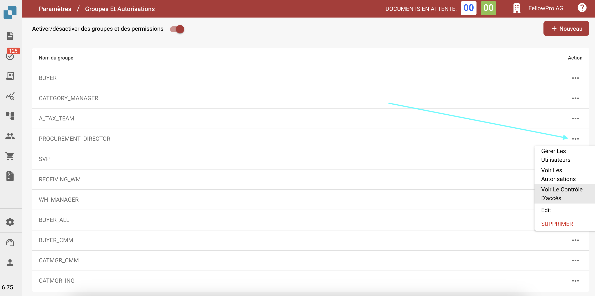
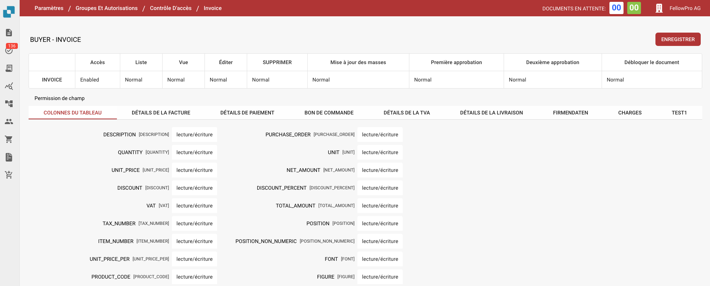

# Contrôle d'Accès

## Vue d'ensemble

Ce guide explique comment les administrateurs peuvent définir les paramètres de contrôle d'accès pour différents groupes d'utilisateurs dans DocBits. Chaque groupe peut être configuré avec des autorisations personnalisées au niveau des documents et des champs.

## Groupes de Contrôle d'Accès

Le panneau de contrôle d'accès permet à l'administrateur de gérer les groupes d'utilisateurs et leurs autorisations respectives. Chaque groupe peut avoir des configurations spécifiques liées à :

* **Accès aux Documents:** Si le groupe peut accéder à un type de document.
* **Autorisations au Niveau des Champs:** Si le groupe peut lire, écrire ou voir certains champs dans un document.
* **Autorisations d'Action:** Quelles actions le groupe peut effectuer, telles que modifier, supprimer, mettre à jour en masse et approuver des documents.

## Activation

1. Naviguez vers **Paramètres**.
2. Sélectionnez **Traitement des documents**.
3. Sélectionnez **Module.**
4. Activez le **Contrôle d'accès** en activant le curseur.

<figure><figcaption></figcaption></figure>

## **Accéder aux Paramètres du Groupe**

1. Accédez à **Paramètres**.
2. Allez dans **Paramètres Globaux**.
3. Sélectionnez **Groupes, Utilisateurs et Autorisations.**
4. Sélectionnez **Groupes et Autorisations**.
5. Pour gérer les autorisations d'un groupe, tel que PROCUREMENT\_DIRECTOR, cliquez sur les trois points sur le côté droit de l'écran.
6. Sélectionnez **Voir le Contrôle d'Accès.**

<figure><figcaption></figcaption></figure>

## Configuration des Autorisations pour les Groupes

1.  **Aperçu du Contrôle d'Accès**:

    * Dans cette section, vous pouvez activer ou désactiver l'accès pour tous les types de documents, tels que **Invoice**, **Credit Note**, **Purchase Order**, et plus encore.
    * Vous pouvez définir des niveaux d'accès tels que:
      * **Accès**: Accorde l'accès au type de document.
      * **Liste**: Définit si le type de document est visible dans la vue liste.
      * **Vue**: Spécifie la vue par défaut pour le document.
      * **Éditer:** Accorde la permission de modifier le document.
      * **Supprimer**: Permet au groupe de supprimer des documents.
      * **Mise à Jour en Masse**: Active la mise à jour en masse du type de document.
      * **Niveaux d'Approbation**: Définit la capacité du groupe à approuver des documents (Approbation de Premier et Deuxième niveau).
      * **Deuxième approbation:** Définit si le groupe peut déverrouiller un document pour d'autres modifications.

    Exemples de paramètres pour **PROCUREMENT\_DIRECTOR**:

    * **Invoice:** Activé pour toutes les autorisations, y compris modifier et supprimer.
    * **Purchase Order:** Activé avec des autorisations normales pour toutes les actions.
2. **Autorisations au Niveau des Champs:**
   * À l'intérieur de chaque type de document, des champs spécifiques peuvent être configurés avec différents niveaux d'autorisations.
   * Les autorisations incluent:
     * **Lecture/Écriture:** Les utilisateurs peuvent à la fois lire et écrire dans le champ.
     * **Lecture/Écriture par le Propriétaire:** Seul le propriétaire du document ou du champ peut écrire, les autres peuvent lire.
     * **Lecture Seule**: Les utilisateurs peuvent seulement voir le champ mais ne peuvent pas le modifier.
     * **Lecture/Écriture par le Propriétaire:** Seul le propriétaire du document ou du champ peut écrire et lire.
     * **Approbation:** Les modifications doivent être approuvées par des utilisateurs ou un administrateur autorisés.
     * **Aucun:** Aucune autorisation spécifique n'est appliquée au champ.

<figure><figcaption></figcaption></figure>
