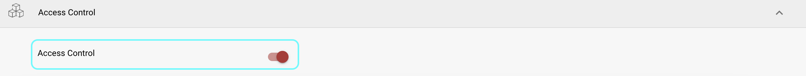
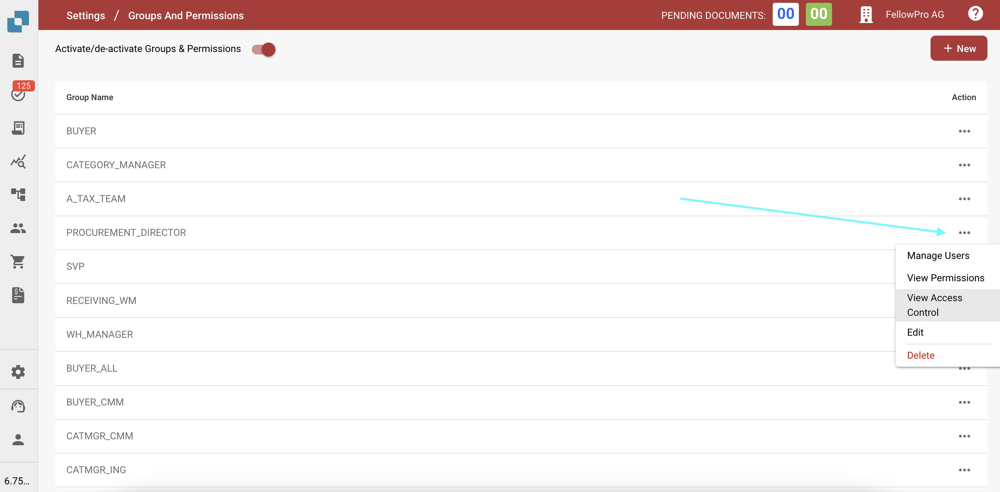

# Kontrola Dostępu

## Przegląd

Ten przewodnik wyjaśnia, jak administratorzy mogą definiować ustawienia kontroli dostępu dla różnych grup użytkowników w DocBits. Każda grupa może być skonfigurowana z niestandardowymi uprawnieniami na poziomie dokumentu i pola.

## Grupy Kontroli Dostępu

Panel kontroli dostępu pozwala administratorowi zarządzać grupami użytkowników i ich odpowiednimi uprawnieniami. Każda grupa może mieć specyficzne konfiguracje związane z:

* **Dostęp do Dokumentów**: Czy grupa może uzyskać dostęp do danego typu dokumentu.
* **Uprawnienia na Poziomie Pola**: Czy grupa może czytać, pisać lub przeglądać określone pola w dokumencie.
* **Uprawnienia do Działań**: Jakie działania grupa może wykonywać, takie jak edytowanie, usuwanie, masowa aktualizacja i zatwierdzanie dokumentów.

## Aktywacja

1. Przejdź do **Ustawień**.
2. Wybierz **Przetwarzanie Dokumentów**.
3. Wybierz **Moduł**.
4. Aktywuj **Kontrolę Dostępu**, włączając suwak.

<figure><figcaption></figcaption></figure>

## **Uzyskiwanie Dostępu do Ustawień Grupy**

1. Przejdź do **Ustawienia**.
2. Przejdź do **Ustawień Globalnych**.
3. Wybierz **Grupy, Użytkownicy i Uprawnienia**.
4. Wybierz **Grupy i Uprawnienia**.
5. Aby zarządzać uprawnieniami dla grupy, takiej jak PROCUREMENT\_DIRECTOR, kliknij trzy kropki po prawej stronie ekranu.
6. Wybierz **Zobacz Kontrolę Dostępu**.

<figure><figcaption></figcaption></figure>

## Konfigurowanie Uprawnień dla Grup

1.  **Przegląd Kontroli Dostępu**:

    * W tej sekcji możesz włączyć lub wyłączyć dostęp dla wszystkich typów dokumentów, takich jak **Faktura**, **Nota Kredytowa**, **Zamówienie Zakupu** i inne.
    * Możesz zdefiniować poziomy dostępu, takie jak:
      * **Włączone**: Przyznaje dostęp do typu dokumentu.
      * **Lista**: Określa, czy typ dokumentu jest widoczny w widoku listy.
      * **Widok**: Określa domyślny widok dla dokumentu.
      * **Edytuj**: Przyznaje uprawnienia do edytowania dokumentu.
      * **Usuń**: Pozwala grupie na usuwanie dokumentów.
      * **Masowa Aktualizacja**: Umożliwia masową aktualizację typu dokumentu.
      * **Poziomy Zatwierdzenia**: Ustala zdolność grupy do zatwierdzania dokumentów (Zatwierdzenie na pierwszym i drugim poziomie).
      * **Odblokuj Dokument**: Określa, czy grupa może odblokować dokument do dalszej edycji.
    * **Poziomy Uprawnień:**
      * **Normal**: Wszyscy użytkownicy mogą wykonać tę akcję.
      * **Owner**: Tylko przypisany użytkownik ma uprawnienia do wykonania tej akcji.
      * **Admin**: Tylko użytkownicy z uprawnieniami administracyjnymi mogą wykonać tę akcję.

    Przykładowe ustawienia dla **PROCUREMENT\_DIRECTOR**:

    * **Faktura**: Włączone dla wszystkich uprawnień, w tym edytowania i usuwania.
    * **Zamówienie Zakupu**: Włączone z normalnymi uprawnieniami dla wszystkich działań.
2. **Uprawnienia na Poziomie Pola**:
   * W każdym typie dokumentu konkretne pola mogą być skonfigurowane z różnymi poziomami uprawnień.
   * Uprawnienia obejmują:
     * **Odczyt/Zapis**: Użytkownicy mogą zarówno czytać, jak i pisać do pola.
     * **Zapis Właściciela**: Tylko właściciel dokumentu lub pola może pisać, inni mogą tylko czytać.
     * **Tylko Odczyt**: Użytkownicy mogą tylko przeglądać pole, ale nie mogą go modyfikować.
     * **Odczyt Właściciela/Zapis Właściciela:** Tylko właściciel dokumentu lub pola może pisać i czytać.
     * **Zatwierdzenie:** Zmiany muszą być zatwierdzone przez uprawnionych użytkowników lub administratora.
     * **Brak**: Żadne konkretne uprawnienia nie są stosowane do pola.

<figure><figcaption></figcaption></figure>
