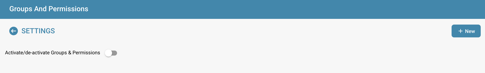

# Activation des autorisations

L'activation ou la désactivation du système d'autorisations à l'aide de l'interrupteur a divers effets sur la fonctionnalité dans DocBits.

## Activation du système d'autorisations:

<figure><figcaption></figcaption></figure>

* Lorsque le système d'autorisations est activé, les autorisations d'accès pour les utilisateurs et les groupes sont appliquées.
* Les utilisateurs ne se voient accorder l'accès qu'aux ressources auxquelles ils sont explicitement autorisés à accéder en fonction des autorisations attribuées.
* Les administrateurs peuvent gérer les autorisations pour les utilisateurs et les groupes individuels et s'assurer que seules les personnes autorisées peuvent consulter ou modifier les données.

<figure><figcaption></figcaption></figure>

## Désactivation du système d'autorisations:

<figure><figcaption></figcaption></figure>

* Lorsque le système d'autorisations est désactivé, toutes les autorisations d'accès sont supprimées et les utilisateurs ont généralement un accès illimité à toutes les ressources.
* Cela peut être utile lorsque la collaboration ouverte est temporairement requise sans les restrictions du contrôle d'accès.
* Cependant, il peut y avoir un risque accru de fuite de données ou d'accès non autorisé, car les utilisateurs peuvent être en mesure d'accéder à des informations sensibles auxquelles ils ne sont pas autorisés à accéder.

L'activation ou la désactivation du système d'autorisations est une décision importante basée sur les exigences de sécurité et le fonctionnement de l'organisation. Dans les environnements où la confidentialité et le contrôle d'accès sont critiques, il est courant de laisser le système d'autorisations activé pour garantir l'intégrité et la confidentialité des données. Dans d'autres cas, la désactivation du système d'autorisations peut être temporairement nécessaire pour faciliter la collaboration, mais elle doit être utilisée avec prudence pour minimiser les risques de sécurité potentiels.
